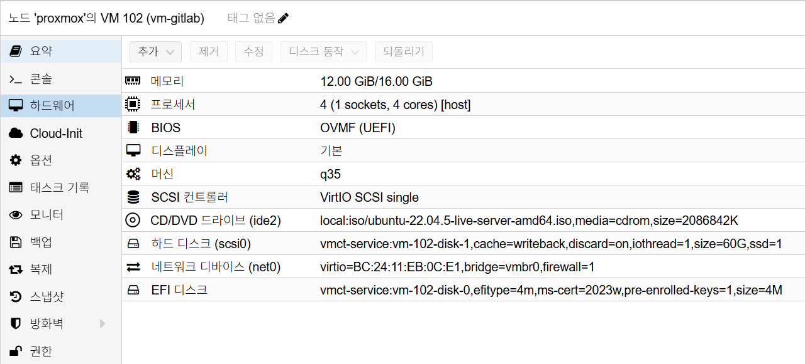

# GitLab Installation

## 개요

이 문서는 VM 기반 GitLab Omnibus 설치 절차를 정의합니다.

설치가 가장 중요한 기준 문서이므로, 구축 직후 필요한 검증, 초기 스냅샷,
기본 운영 기준, Runner 운영 기준, Keycloak OIDC 준비, 자주 발생하는 이슈까지
이 문서에 포함합니다.

## 사전 조건

- OS: Ubuntu 22.04 LTS
- VM 리소스: 최소 `4 vCPU / 12GB RAM`
- 디스크: OS `60GB` (기본 설치)
- 권장 디스크: 운영 환경은 `100GB+` 권장
- 도메인: `gitlab.semtl.synology.me`
- 외부 URL: `https://gitlab.semtl.synology.me`
- Synology Reverse Proxy 경유 노출

### Proxmox VM H/W 참고 이미지

아래 이미지는 Proxmox `Hardware` 탭 기준의 GitLab VM 구성 예시입니다.



캡션: `4 vCPU`, `12GB ~ 16GB RAM`, `q35`, `OVMF (UEFI)`, OS Disk `60GB`, `vmbr0`

## 네트워크 기준

- `net0` 단일 NIC 사용 (`192.168.0.x`)
- 예시 VM IP: `192.168.0.172`

## 설치 절차

### 1. 60GB 기본 설치

#### 1.1 기본 패키지 설치

```bash
# 패키지 목록 갱신
sudo apt update

# 필수 도구 설치
sudo apt install -y curl ca-certificates tzdata openssh-server perl
```

#### 1.2 GitLab 저장소 등록

```bash
# GitLab 패키지 저장소 스크립트 URL 조합
REPO_SCRIPT_URL="https://packages.gitlab.com/install/repositories/"
REPO_SCRIPT_URL="${REPO_SCRIPT_URL}gitlab/gitlab-ee/script.deb.sh"

# GitLab 패키지 저장소 등록
curl -fsSL "$REPO_SCRIPT_URL" | sudo bash
```

#### 1.3 GitLab Omnibus 기본 설치

초기 설치는 로컬 HTTP 엔드포인트로 진행합니다.

```bash
# 초기 설치는 로컬 HTTP 엔드포인트로 진행
sudo EXTERNAL_URL="http://192.168.0.172" \
apt install -y gitlab-ee=18.8.4-ee.0
```

#### 1.4 Reverse Proxy 정책 반영 및 서비스 확인

기본 설치 완료 후 `/etc/gitlab/gitlab.rb`에 Reverse Proxy 운영 정책을 반영합니다.

```bash
# 기존 파일 백업(UTC 타임스탬프)
sudo cp /etc/gitlab/gitlab.rb /etc/gitlab/gitlab.rb.bak.$(date -u +%Y%m%d%H%M%S)

# 기존 관리 블록이 있으면 제거(멱등 적용)
sudo awk '
  BEGIN {skip=0}
  /^# BEGIN semtl reverse-proxy policy$/ {skip=1; next}
  /^# END semtl reverse-proxy policy$/ {skip=0; next}
  skip==0 {print}
' /etc/gitlab/gitlab.rb | sudo tee /etc/gitlab/gitlab.rb >/dev/null

# 운영 정책 블록 추가
sudo tee -a /etc/gitlab/gitlab.rb >/dev/null <<'EOF'
# BEGIN semtl reverse-proxy policy
external_url 'https://gitlab.semtl.synology.me'
letsencrypt['enable'] = false
nginx['listen_port'] = 80
nginx['listen_https'] = false
registry['enable'] = false
gitlab_rails['registry_enabled'] = false
gitlab_rails['trusted_proxies'] = ['192.168.0.0/24']
nginx['real_ip_trusted_addresses'] = ['192.168.0.0/24']
nginx['real_ip_header'] = 'X-Forwarded-For'
nginx['real_ip_recursive'] = 'on'
# END semtl reverse-proxy policy
EOF
```

```bash
# 관리 블록 적용 여부 확인
sudo sed -n \
  '/# BEGIN semtl reverse-proxy policy/,/# END semtl reverse-proxy policy/p' \
  /etc/gitlab/gitlab.rb

# 핵심 키워드 확인
sudo grep -nE \
  "external_url|letsencrypt|listen_port|listen_https|registry_enabled|\
trusted_proxies|real_ip_" \
  /etc/gitlab/gitlab.rb

# 설정 반영
sudo gitlab-ctl reconfigure

# 서비스 상태 확인
sudo gitlab-ctl status
```

## 방화벽 / 포트 체크

- GitLab VM 입력 포트(내부망): `22`, `80`
- GitLab VM `443`은 기본 비활성 (`nginx['listen_https'] = false`)
- Synology Reverse Proxy 입력 포트(외부/내부 공통): `443`
- Reverse Proxy 경유 시 사용자 접속 URL은 `https://gitlab.semtl.synology.me`만 사용

직접 IP 접속 참고:

- `http://192.168.0.172`로 접속해도 `external_url` 정책에 따라
  HTTPS 경로로 리다이렉트될 수 있음
- `https://192.168.0.172` 직접 접속은 인증서 또는 SAN 불일치, VM `443` 비활성으로 실패 가능
- 운영 검증은 반드시 `https://gitlab.semtl.synology.me` 기준으로 수행

## 설치 검증

```bash
# GitLab 상태 확인
sudo gitlab-ctl status

# 헬스체크
curl -I https://gitlab.semtl.synology.me

# GitLab 내부 상태 점검
sudo gitlab-rake gitlab:check

# 설치 버전 확인
sudo gitlab-rake gitlab:env:info | sed -n '1,120p'

# (선택) 초기 root 비밀번호 확인(파일이 남아있는 경우에만)
sudo cat /etc/gitlab/initial_root_password
```

검증 기준:

- GitLab 로그인 페이지 응답
- `gitlab-ctl status`에서 주요 서비스가 `run`
- `gitlab:check` 주요 오류 없음
- 설치 버전이 의도한 버전과 일치

## 초기 관리자 비밀번호 변경 / 재설정

초기 로그인 후 `root` 비밀번호는 즉시 변경합니다.

`/etc/gitlab/initial_root_password`가 비어 있거나 파일이 제거된 경우에도
아래 명령으로 `root` 비밀번호를 재설정할 수 있습니다.

```bash
# (선택) 비밀번호 길이 정책 키 확인
sudo gitlab-rails runner "s=ApplicationSetting.current; p s.attributes.keys.grep(/password|length/)"

# (선택) 최소 비밀번호 길이 변경(예: 8)
sudo gitlab-rails runner \
  "s=ApplicationSetting.current; s.update!(minimum_password_length: 8); puts s.minimum_password_length"

# root 비밀번호 재설정(새 비밀번호 2회 입력)
sudo gitlab-rake "gitlab:password:reset[root]"
```

보안 운영 권장:

- 초기 비밀번호는 평문으로 보관하지 않음
- 비밀번호 변경 후 `/etc/gitlab/initial_root_password` 파일 삭제 여부 확인
- 로컬 `root` 계정은 브레이크글래스 용도로 유지

## 초기 스냅샷

스냅샷 생성 전 아래 정리 작업을 먼저 수행합니다.

```bash
sudo rm -rf /tmp/*
sudo rm -rf /var/tmp/*
sudo apt autoremove -y
sudo apt clean
sudo journalctl --vacuum-time=1s
cat /dev/null > ~/.bash_history && history -c
```

- 시점: `60GB` 기본 설치 + Reverse Proxy 정책 반영 + `reconfigure` / 로그인 검증 완료 후
- Proxmox에서 GitLab VM 선택
- `Snapshots > Take Snapshot` 실행
- 권장 이름: `gitlab-install-clean-v1`
- 설명 예시:

  ```text
  [설치]
  - gitlab-ee : 18.8.4
  - external_url : https://gitlab.semtl.synology.me
  - reverse proxy : synology(443) -> gitlab vm(80)
  - letsencrypt : disabled
  - registry : disabled
  - id : root
  - pw : <change-required>
  ```

- `Include RAM`은 비활성화 권장

## 설치 직후 운영 기준

- GitLab URL: `https://gitlab.semtl.synology.me`
- 컨테이너 이미지 Registry는 Harbor 사용
- GitLab Container Registry는 운영 정책상 비사용
- Runner 실행 위치는 Kubernetes (`executor = kubernetes`) 기준

### 정책 배경

- GitLab Container Registry 비사용 이유
  - Registry를 Harbor로 단일화해 운영 지점을 줄이고 권한, 취약점, 백업 정책을 한 곳에서 관리
  - GitLab과 Harbor에 중복 저장되는 이미지와 스토리지 비용 방지
  - CI 파이프라인의 이미지 push 대상을 일관되게 유지
- MinIO 사용 이유
  - GitLab Object Storage를 OS 로컬 디스크가 아닌 외부 스토리지로 분리
  - GitLab VM 용량을 코드와 메타데이터 중심으로 유지하고 대용량 파일은 MinIO로 오프로드
  - 백업 및 복구 시 GitLab 앱과 대용량 오브젝트를 분리해 운영 유연성 확보

설치 후 연동 작업은 아래 문서를 사용합니다.

- [GitLab MinIO 연동](./minio-integration.md)
- [GitLab Harbor 연동](./harbor-integration.md)

## Runner 운영 절차

### 1. Runner 토큰 발급

권장 우선순위:

1. Group Runner (`devops` 그룹)
2. 불가 시 Instance Runner

그룹 경로:

- `devops` 그룹 -> `Settings` -> `CI/CD` -> `Runners`
- `New group runner` 선택

필수 설정:

- Description: `k8s-runner`
- Tags: `k8s`
- Run untagged jobs: 체크
- Locked to current project: 해제

### 2. Kubernetes Runner 설치

```bash
helm repo add gitlab https://charts.gitlab.io
helm repo update

helm install gitlab-runner gitlab/gitlab-runner \
  --namespace gitlab-runner \
  --create-namespace \
  -f values.yaml
```

`values.yaml` 핵심 예시:

```yaml
gitlabUrl: https://gitlab.semtl.synology.me
runnerRegistrationToken: "<glrt-token>"
runners:
  executor: kubernetes
  config: |
    [[runners]]
      [runners.kubernetes]
        namespace = "gitlab-runner"
        image = "ubuntu:22.04"
        privileged = true
```

### 3. Runner 상태 확인

```bash
kubectl -n gitlab-runner get pods
```

- GitLab UI에서 runner online 상태를 함께 확인합니다.

## Keycloak OIDC 연동 준비

### 대상 환경

- Keycloak: `https://auth.semtl.synology.me`
- Realm: `semtl`
- GitLab: `https://gitlab.semtl.synology.me`
- GitLab 배포: Omnibus

### 1. 사전 점검

1. Realm discovery endpoint 확인

```bash
DISCOVERY_URL="https://auth.semtl.synology.me/realms/semtl/.well-known/openid-configuration"
curl -s "$DISCOVERY_URL" | head
```

1. GitLab 외부 URL 확인: `https://gitlab.semtl.synology.me`
1. Reverse Proxy가 `X-Forwarded-*` 헤더를 정상 전달하는지 확인

### 2. Keycloak Client 생성

경로: `Realm(semtl) -> Clients -> Create client`

기본 설정:

- Client type: `OpenID Connect`
- Client ID: `gitlab`
- Client authentication: `ON` (Confidential)
- Standard flow: `ON`
- Authorization: `OFF`
- Direct access grants: `OFF`
- Service account roles: `OFF`
- PKCE Method: `S256`

Login settings:

- Root URL: `https://gitlab.semtl.synology.me`
- Home URL: `https://gitlab.semtl.synology.me`
- Valid Redirect URIs:
  - `https://gitlab.semtl.synology.me/users/auth/openid_connect/callback`
- Valid Post Logout Redirect URIs:
  - `https://gitlab.semtl.synology.me/`
- Web origins:
  - `https://gitlab.semtl.synology.me`

생성 후 `Credentials` 탭에서 Client Secret을 확인합니다.

### 3. Keycloak 사용자 준비

OIDC 로그인은 Keycloak 사용자를 기준으로 동작합니다.

필수 항목:

- Username
- Password (`Credentials` 탭)
- Email 권장
- Email verified `ON` 권장

### 4. GitLab Omnibus OIDC 설정

`/etc/gitlab/gitlab.rb`에 아래 설정을 추가합니다.

```ruby
gitlab_rails['omniauth_enabled'] = true
gitlab_rails['omniauth_allow_single_sign_on'] = ['openid_connect']
gitlab_rails['omniauth_block_auto_created_users'] = false

gitlab_rails['omniauth_providers'] = [
  {
    name: "openid_connect",
    label: "Keycloak",
    args: {
      name: "openid_connect",
      scope: ["openid","profile","email"],
      response_type: "code",
      issuer: "https://auth.semtl.synology.me/realms/semtl",
      discovery: true,
      client_auth_method: "basic",
      uid_field: "sub",
      send_scope_to_token_endpoint: true,
      pkce: true,
      client_options: {
        identifier: "gitlab",
        secret: "<keycloak-client-secret>",
        redirect_uri: "https://gitlab.semtl.synology.me/users/auth/openid_connect/callback"
      }
    }
  }
]
```

적용:

```bash
sudo gitlab-ctl reconfigure
sudo gitlab-ctl restart
```

### 5. OIDC 정합성 검증

1. GitLab 로그인 페이지에 `Keycloak` 버튼 노출 확인
2. 버튼 클릭 후 Keycloak 로그인 성공 확인
3. GitLab 자동 사용자 생성 확인
4. 필요 시 사용자 타입을 `Administrator`로 승격
5. Redirect URI와 Callback URI가 정확히 일치하는지 확인

## 주간 점검

```bash
sudo gitlab-ctl status
sudo gitlab-ctl tail | egrep -i 'error|exception|fail'
kubectl -n gitlab-runner get pods -o wide
```

## 자주 발생하는 이슈

### 1. Group Runner 생성 버튼이 보이지 않음

증상:

- `Settings > CI/CD > Runners`에서 `New group runner` 미노출

주요 원인:

- 그룹 Owner 권한 부족
- Admin 영역에서 Group Runner 생성 제한

조치:

1. 그룹 Owner 권한 확인
2. Admin -> CI/CD -> Runners에서 Group Runner 허용 확인
3. 우회로로 Instance Runner 생성 후 사용

### 2. Runner 등록 토큰 발급 실패

증상:

- 기존 방식처럼 Registration token 위치가 보이지 않음

주요 원인:

- GitLab 18.x는 Runner 생성 후 토큰 발급 방식으로 변경

조치:

- `New runner` 생성 후 발급되는 `glrt-...` 토큰 사용

### 3. Runner는 Online인데 Job이 실행되지 않음

증상:

- Job pending 지속

주요 원인:

- `Run untagged jobs` 비활성
- Job tags와 Runner tags 불일치

조치:

- Runner의 `Run untagged jobs` 활성화
- 또는 `.gitlab-ci.yml`에 `tags: [k8s]` 지정

### 4. OIDC 로그인 실패

증상:

- 로그인 시 redirect 또는 callback 오류

주요 원인:

- Keycloak client의 redirect URI 불일치
- GitLab `gitlab.rb` OIDC 설정 오타

조치:

- Callback URI를 정확히 일치시킴
- `sudo gitlab-ctl reconfigure` 후 재검증

### 5. 로그인 화면에 `Keycloak` 버튼이 보이지 않음

증상:

- GitLab 로그인 화면이 로컬 계정 폼만 표시

주요 원인:

- `gitlab.rb` OIDC 설정 누락 또는 오타
- `gitlab-ctl reconfigure` 미실행

조치:

```bash
sudo gitlab-ctl reconfigure
sudo gitlab-ctl restart
sudo gitlab-ctl tail gitlab-rails
```

### 6. Keycloak 로그인 사용자로 인증 불가

증상:

- Keycloak 버튼 클릭 후 로그인 실패

주요 원인:

- Realm에 로그인 대상 사용자가 없음
- 사용자 비밀번호가 설정되지 않음

조치:

1. Keycloak `Users`에서 사용자 생성
2. `Credentials`에서 비밀번호 설정
3. Email 및 Email verified 상태 확인

### 7. Keycloak 이름 변경이 GitLab에 즉시 반영되지 않음

증상:

- Keycloak first 또는 last name 변경 후 GitLab 프로필 이름이 유지됨

주요 원인:

- 기존 GitLab 사용자 프로필은 OIDC 로그인 시 자동 동기화가 제한적임

조치:

- GitLab 사용자 프로필에서 이름을 수동 수정

## 에스컬레이션 기준

- Runner Offline 15분 이상 지속
- 모든 사용자 OIDC 로그인 실패
- 배포 파이프라인 전체 중단

## 보안 주의사항

- Runner 토큰을 문서 또는 채팅에 평문 공유하지 않습니다.
- OIDC client secret과 root 비밀번호는 문서에 직접 남기지 않습니다.
- `privileged=true`는 필요성 검토 없이 상시 사용하지 않습니다.
- OIDC callback URI 미일치 상태로 설정을 반영하지 않습니다.
