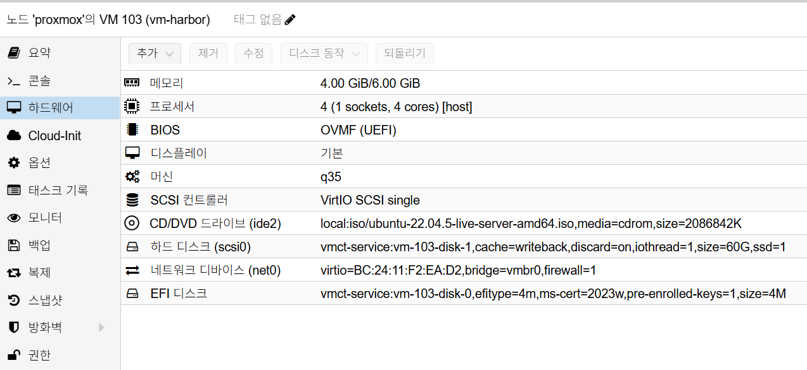

# Harbor Installation

## 개요

이 문서는 VM 기반 Harbor 기본 설치 절차를 정의합니다.

## 사전 조건

- OS: Ubuntu 22.04 LTS
- VM 리소스: 최소 `2 vCPU / 6GB RAM`
- 디스크: OS `60GB` 이상
- Harbor 버전: `v2.13.2`
- 배치: VM 설치 (Kubernetes 배치 금지)
- 도메인: `harbor.semtl.synology.me`
- Reverse Proxy 경유 노출

### Proxmox VM H/W 참고 이미지

아래 이미지는 Proxmox `Hardware` 탭 기준의 Harbor VM 구성 예시입니다.



캡션: `2 vCPU`, `6GB RAM`, OS Disk `60GB`

## 네트워크 기준

- `net0` 단일 NIC 사용 (`192.168.0.x`)
- 예시 VM IP: `192.168.0.173`

## 설치 절차

### 1. Docker/Compose 설치

```bash
# Docker 설치
curl -fsSL https://get.docker.com | sh

# Docker 서비스 자동 시작 활성화
sudo systemctl enable --now docker

# compose plugin 설치
sudo apt update
sudo apt install -y docker-compose-plugin

# Docker 서비스 상태 확인
sudo systemctl status docker --no-pager
```

### 2. Harbor 오프라인 패키지 준비

```bash
# 작업 디렉터리 이동
cd ~

# Harbor 오프라인 설치 번들 다운로드(고정 버전)
curl -fLO "https://github.com/goharbor/harbor/releases/download/v2.13.2/harbor-offline-installer-v2.13.2.tgz"

# 다운로드 파일 확인
ls -lh harbor-offline-installer-v2.13.2.tgz

# 압축 해제
tar -xzf harbor-offline-installer-v2.13.2.tgz
```

### 3. `harbor.yml` 설정

```bash
# Harbor 설정 파일 생성
cd ~/harbor
cp harbor.yml.tmpl harbor.yml

# 설정 파일 편집
sudo editor harbor.yml
```

핵심 항목(주석 해제/수정):

- `hostname: harbor.semtl.synology.me`
- `http: port: 80`
- `harbor_admin_password: <초기 관리자 비밀번호>` (설치 전에 지정하면 초기 로그인부터 적용)
- HTTPS 인증서는 Reverse Proxy에서 종료하므로 Harbor VM에서는 `https:` 블록 비활성(또는 미사용)
- 내부 저장소는 기본 filesystem 사용(초기 설치 기준)

### 4. Harbor 설치 실행

```bash
# 기본(권장): sudo 일관 실행
cd ~/harbor
sudo ./prepare
sudo ./install.sh
```

### 5. 재부팅 자동 기동 보장(systemd)

Docker 자동 기동만으로 Harbor가 항상 올라오지 않는 경우가 있어,
부팅 시 Harbor compose를 강제로 올리는 유닛을 **필수 등록**합니다.

```bash
sudo tee /etc/systemd/system/harbor.service >/dev/null <<'SERVICE'
[Unit]
Description=Harbor Container Service
# Docker 기동 후, 네트워크 준비 이후 Harbor compose 실행
After=docker.service network-online.target
Requires=docker.service
Wants=network-online.target

[Service]
# systemd는 "기동 트리거"만 수행하고 종료(컨테이너는 Docker가 관리)
Type=oneshot
# Harbor 설치 디렉터리
WorkingDirectory=/home/semtl/harbor
# 백그라운드(-d)로 compose 스택 기동
ExecStart=/usr/bin/docker compose up -d
ExecStop=/usr/bin/docker compose down
RemainAfterExit=yes
TimeoutStartSec=0

[Install]
WantedBy=multi-user.target
SERVICE

sudo systemctl daemon-reload
sudo systemctl enable --now harbor.service
sudo systemctl status harbor.service --no-pager
```

서비스를 등록하지 않은 상태에서 재부팅 후 컨테이너가 `Exited (128)`로 내려가면
아래 명령으로 즉시 복구합니다.

```bash
cd ~/harbor
sudo docker compose down
sudo docker compose up -d
sudo docker ps -a
```

## 방화벽/포트 체크

- VM 내부 포트: `80`, `443` (Reverse Proxy 연결 경로)

## 설치 검증

```bash
# Harbor 컨테이너 상태
sudo docker ps

# 외부 URL 응답 확인
curl -I https://harbor.semtl.synology.me

# 컨테이너 이미지 태그로 확인
sudo docker ps --format '{{.Image}}' | grep goharbor

# 재부팅 후 자동 기동 확인
sudo reboot

# 재접속 후:
sudo systemctl is-enabled docker
sudo systemctl is-enabled harbor.service
sudo systemctl status harbor.service --no-pager
sudo docker ps | grep -E 'harbor-core|harbor-portal|harbor-jobservice'
```

검증 기준:

- 로그인 페이지 응답
- 이미지 프로젝트 생성 가능
- Harbor 컨테이너 이미지 태그가 `v2.13.2`로 확인됨

## 6. 설치 직후 정리 후 스냅샷

스냅샷은 반드시 불필요 파일(찌꺼기) 정리 후 생성합니다.

### 6.1 불필요 파일 정리

```bash
# /tmp 전체 삭제
sudo rm -rf /tmp/*

# /var/tmp 전체 삭제
sudo rm -rf /var/tmp/*

# 미사용 패키지 정리
sudo apt autoremove -y

# APT 캐시 정리
sudo apt clean

# journal 로그 전체 정리
sudo journalctl --vacuum-time=1s

# 현재 사용자 bash 히스토리 비우기
cat /dev/null > ~/.bash_history && history -c
```

### 6.2 Proxmox 스냅샷 생성

- 관리자 비밀번호 변경 후 생성
- Robot account 생성 전 생성
- OIDC 연동 전 생성
- Proxmox에서 Harbor VM 선택
- `Snapshots > Take Snapshot` 실행
- 이름 예시: `harbor-install-clean-v1`
- 설명 예시:
  ```text
  [설치]
  - harbor : v2.13.2
  - hostname : harbor.semtl.synology.me
  - reverse proxy : synology(443) -> harbor vm(80)
  - id : admin
  - pw : 패스워드(설치 시 지정값)
  ```
- `Include RAM`은 비활성화(권장)

## 참고

- GitLab Container Registry는 비활성 정책
- 이미지 저장소는 Harbor로 통일
- MinIO S3 backend 연동은 별도 문서 참고: [Harbor MinIO 연동](./minio-integration.md)
