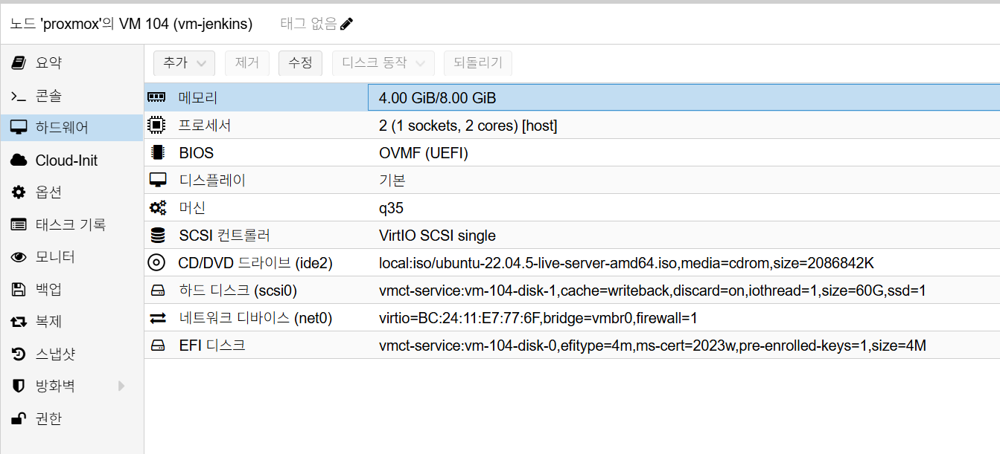

# Jenkins Installation

## 개요

이 문서는 VM 기반 Jenkins 네이티브 설치(`apt` + `systemd`) 절차를 정의합니다.

## 사전 조건

- OS: Ubuntu 22.04 LTS
- VM 리소스: `2 vCPU / 4GB ~ 8GB RAM`
- 디스크: OS `60GB`
- Jenkins 버전: `2.516.1`
- 도메인: `jenkins.semtl.synology.me`
- Reverse Proxy 경유 노출

### Proxmox VM H/W 참고 이미지

아래 이미지는 Proxmox `Hardware` 탭 기준의 Jenkins VM 구성 예시입니다.



캡션: `2 vCPU`, `4GB ~ 8GB RAM`, `q35`, `OVMF (UEFI)`, OS Disk `60GB`, `vmbr0`

## 배치 원칙

- Jenkins Controller는 VM에 단독 배치
- Jenkins Agent는 Kubernetes에서 실행(향후 연동)
- Artifact/Backup/Object Storage는 MinIO 연동(향후 연동)
- 메모리는 `4GB`를 기본 할당으로 두고 필요 시 `8GB`까지 확장

## 설치 절차

### 1. Java 및 Jenkins 저장소 설정

```bash
# 패키지 인덱스 갱신
sudo apt update

# Java 21 및 기본 도구 설치
sudo apt install -y openjdk-21-jre ca-certificates curl gnupg

# Jenkins 저장소 키 등록
sudo install -m 0755 -d /etc/apt/keyrings
curl -fsSL https://pkg.jenkins.io/debian-stable/jenkins.io-2023.key \
  | gpg --dearmor \
  | sudo tee /etc/apt/keyrings/jenkins-keyring.gpg >/dev/null
sudo chmod a+r /etc/apt/keyrings/jenkins-keyring.gpg

# Jenkins 저장소 등록
echo "deb [signed-by=/etc/apt/keyrings/jenkins-keyring.gpg] \
https://pkg.jenkins.io/debian-stable binary/" \
  | sudo tee /etc/apt/sources.list.d/jenkins.list >/dev/null

# NO_PUBKEY 7198F4B714ABFC68 대응(키 병합)
gpg --no-default-keyring --keyring ./jenkins-extra.gpg \
  --keyserver hkps://keyserver.ubuntu.com \
  --recv-keys 7198F4B714ABFC68
gpg --no-default-keyring --keyring ./jenkins-extra.gpg --export \
  | sudo tee -a /etc/apt/keyrings/jenkins-keyring.gpg >/dev/null
rm -f ./jenkins-extra.gpg
sudo chmod a+r /etc/apt/keyrings/jenkins-keyring.gpg

```

### 2. Jenkins 2.516.1 설치

```bash
# 저장소 반영
sudo apt update

# 설치 가능한 버전 확인
apt-cache madison jenkins

# Jenkins 2.516.1 설치
sudo apt install -y jenkins=2.516.1

# 자동 시작 활성화(초기 설정 적용 전까지는 중지 상태 유지)
sudo systemctl enable jenkins
sudo systemctl stop jenkins || true
```

### 3. 초기 관리자 계정/비밀번호 사전 지정(필수)

```bash
# 초기 관리자 계정 정보 파일 생성(이후 단계에서 동일 값 재사용)
sudo tee /var/lib/jenkins/jenkins-admin.env >/dev/null <<'EOF'
JENKINS_ADMIN_ID='admin'
JENKINS_ADMIN_PASSWORD='패스워드입력'
JENKINS_URL='https://jenkins.semtl.synology.me/'
EOF
sudo chown jenkins:jenkins /var/lib/jenkins/jenkins-admin.env
sudo chmod 600 /var/lib/jenkins/jenkins-admin.env

# 변수 로드(파일 권한 600이므로 sudo로 읽기)
JENKINS_ADMIN_ID=$(sudo sed -n "s/^JENKINS_ADMIN_ID='\\(.*\\)'$/\\1/p" /var/lib/jenkins/jenkins-admin.env)
JENKINS_ADMIN_PASSWORD=$(
  sudo sed -n "s/^JENKINS_ADMIN_PASSWORD='\\(.*\\)'$/\\1/p" \
  /var/lib/jenkins/jenkins-admin.env
)
JENKINS_URL=$(sudo sed -n "s/^JENKINS_URL='\\(.*\\)'$/\\1/p" /var/lib/jenkins/jenkins-admin.env)

# setup wizard 비활성 옵션 적용
sudo mkdir -p /var/lib/jenkins
echo "2.0" | sudo tee /var/lib/jenkins/jenkins.install.UpgradeWizard.state >/dev/null
echo "RUNNING" \
  | sudo tee /var/lib/jenkins/jenkins.install.InstallUtil.lastExecVersion >/dev/null

# 초기 관리자 계정 재생성/비밀번호 강제 적용 스크립트 배치(1회용)
sudo mkdir -p /var/lib/jenkins/init.groovy.d
sudo tee /var/lib/jenkins/init.groovy.d/01-reset-admin-user.groovy >/dev/null <<EOF
import jenkins.model.*
import jenkins.model.JenkinsLocationConfiguration
import hudson.security.*
import hudson.model.User

def instance = Jenkins.get()
def hudsonRealm = new HudsonPrivateSecurityRealm(false)
instance.setSecurityRealm(hudsonRealm)

def user = User.getById("${JENKINS_ADMIN_ID}", false)
if (user != null) {
  user.delete()
}
hudsonRealm.createAccount("${JENKINS_ADMIN_ID}", "${JENKINS_ADMIN_PASSWORD}")

def strategy = new FullControlOnceLoggedInAuthorizationStrategy()
strategy.setAllowAnonymousRead(false)
instance.setAuthorizationStrategy(strategy)

def jlc = JenkinsLocationConfiguration.get()
jlc.setUrl("${JENKINS_URL}")
jlc.save()

// Controller에서 빌드를 막아 "built-in node" 경고를 제거하고 전용 Agent 사용을 강제한다.
instance.setNumExecutors(0)
instance.save()
EOF

sudo chown -R jenkins:jenkins /var/lib/jenkins/init.groovy.d
sudo chown jenkins:jenkins \
  /var/lib/jenkins/jenkins.install.UpgradeWizard.state \
  /var/lib/jenkins/jenkins.install.InstallUtil.lastExecVersion
```

주의:

- 여기서 지정한 `JENKINS_ADMIN_ID`, `JENKINS_ADMIN_PASSWORD` 값을 이후 CLI/검증 명령에서도 동일하게 사용합니다.
- 비밀번호에 `#`가 포함되면 작은따옴표로 감싸서 지정합니다.
  - 예: `JENKINS_ADMIN_PASSWORD='패스워드입력'`

### 4. 플러그인 목록 준비

기본 설치에서는 Kubernetes 관련 플러그인을 포함하지 않습니다.
Kubernetes 플러그인은 Agent 연동 시점(7장)에서 추가 설치합니다.

```bash
# Jenkins 플러그인 목록 생성
sudo tee /var/lib/jenkins/plugins.txt >/dev/null <<'EOF'
workflow-aggregator
git
gitlab-plugin
gitlab-api
configuration-as-code
docker-workflow
blueocean
oic-auth
matrix-auth
role-strategy
credentials-binding
aws-credentials
artifact-manager-s3
pipeline-utility-steps
EOF

sudo chown jenkins:jenkins /var/lib/jenkins/plugins.txt
```

플러그인 구성 기준:

- 기본 CI/CD: `workflow-aggregator`, `git`, `configuration-as-code`,
  `docker-workflow`, `blueocean`, `oic-auth`, `matrix-auth`,
  `role-strategy`, `credentials-binding`
- GitLab 연동 보강: `gitlab-plugin`, `gitlab-api`
- MinIO(S3)/향후 연동 보강: `aws-credentials`, `artifact-manager-s3`,
  `pipeline-utility-steps`

### 5. 플러그인 설치 적용(Jenkins CLI)

```bash
# Jenkins 기동
sudo systemctl start jenkins
sleep 10
sudo systemctl status jenkins --no-pager

# Jenkins HTTP 준비 대기
until curl -fsS http://127.0.0.1:8080/login >/dev/null; do sleep 2; done

# Jenkins CLI 다운로드
curl -fsSL -o /tmp/jenkins-cli.jar http://127.0.0.1:8080/jnlpJars/jenkins-cli.jar

# 관리자 계정 정보 로드(3단계와 동일)
JENKINS_ADMIN_ID=$(sudo sed -n "s/^JENKINS_ADMIN_ID='\\(.*\\)'$/\\1/p" \
  /var/lib/jenkins/jenkins-admin.env)
JENKINS_ADMIN_PASSWORD=$(
  sudo sed -n "s/^JENKINS_ADMIN_PASSWORD='\\(.*\\)'$/\\1/p" \
  /var/lib/jenkins/jenkins-admin.env
)

# 인증 확인(200 응답 확인)
curl -i --user "${JENKINS_ADMIN_ID}:${JENKINS_ADMIN_PASSWORD}" \
  http://127.0.0.1:8080/me/api/json

# 1회 적용 스크립트 비활성화(재시작 시 admin 재생성 방지)
sudo mv /var/lib/jenkins/init.groovy.d/01-reset-admin-user.groovy \
  /var/lib/jenkins/init.groovy.d/01-reset-admin-user.groovy.done

# plugins.txt 기반 플러그인 설치 후 Jenkins 재시작
PLUGINS="$(tr '\n' ' ' </var/lib/jenkins/plugins.txt)"
java -jar /tmp/jenkins-cli.jar -http \
  -s http://127.0.0.1:8080/ \
  -auth "${JENKINS_ADMIN_ID}:${JENKINS_ADMIN_PASSWORD}" \
  install-plugin ${PLUGINS} -restart
```

## 방화벽/포트 체크

- VM 내부 포트: `8080`, `50000`
- Reverse Proxy 경유 시 외부 공개는 `443`만 사용

## 설치 검증

```bash
# Jenkins 버전 확인
curl -fsSI http://127.0.0.1:8080/login | grep -i '^X-Jenkins:'

# 외부 URL 응답 확인
curl -I https://jenkins.semtl.synology.me

# 관리자 계정 변수 로드(3단계와 동일)
JENKINS_ADMIN_ID=$(sudo sed -n "s/^JENKINS_ADMIN_ID='\\(.*\\)'$/\\1/p" \
  /var/lib/jenkins/jenkins-admin.env)
JENKINS_ADMIN_PASSWORD=$(
  sudo sed -n "s/^JENKINS_ADMIN_PASSWORD='\\(.*\\)'$/\\1/p" \
  /var/lib/jenkins/jenkins-admin.env
)

# 주요 플러그인 설치 확인
curl -fsSL --user "${JENKINS_ADMIN_ID}:${JENKINS_ADMIN_PASSWORD}" \
  "http://127.0.0.1:8080/pluginManager/api/json?depth=1" \
  | grep -E '"shortName":"(oic-auth|artifact-manager-s3|aws-credentials|gitlab-plugin|gitlab-api)"'

# Jenkins URL 설정 확인(빈 값이면 안 됨)
JENKINS_URL_PATTERN='<jenkinsUrl>https://jenkins\.semtl\.synology\.me/?</jenkinsUrl>'
if [ -f /var/lib/jenkins/jenkins.model.JenkinsLocationConfiguration.xml ]; then
  sudo grep -E "${JENKINS_URL_PATTERN}" \
    /var/lib/jenkins/jenkins.model.JenkinsLocationConfiguration.xml
else
  sudo grep -E "${JENKINS_URL_PATTERN}" /var/lib/jenkins/config.xml
fi

```

검증 기준:

- Jenkins 로그인 페이지 응답
- Jenkins 버전 헤더(`X-Jenkins`) 응답 확인
- OIDC/MinIO/GitLab 관련 주요 플러그인 설치 확인
- `Jenkins URL`이 비어 있지 않음
- Reverse Proxy 도메인 접속 가능

## 7. Kubernetes 연동 문서

Kubernetes Agent 연동 절차는 별도 문서에서 관리합니다.

- [Jenkins Kubernetes Agent Integration](./kubernetes-agent-integration.md)

## 8. 기본 설치 스냅샷

스냅샷 생성 전 아래 정리 작업을 먼저 수행합니다.

```bash
sudo rm -rf /tmp/*
sudo rm -rf /var/tmp/*
sudo apt autoremove -y
sudo apt clean
sudo journalctl --vacuum-time=1s
cat /dev/null > ~/.bash_history && history -c
```

- 시점: `2.516.1` 설치 + 초기 관리자 계정 검증 + 플러그인 설치 검증 완료 후
- Proxmox에서 Jenkins VM 선택
- `Snapshots > Take Snapshot` 실행
- 권장 이름: `jenkins-install-clean-v1`
- 설명 예시:

  ```text
  [설치]
  - jenkins : 2.516.1
  - jenkins_url : https://jenkins.semtl.synology.me
  - reverse proxy : synology(443) -> jenkins vm(8080)
  - controller : vm(native)
  - installed_plugins :
    - workflow-aggregator, git, gitlab-plugin, gitlab-api
    - configuration-as-code, docker-workflow, blueocean
    - oic-auth, matrix-auth, role-strategy, credentials-binding
    - aws-credentials, artifact-manager-s3, pipeline-utility-steps
  - id : admin
  - pw : 패스워드(설치 시 지정값)
  ```

- `Include RAM`은 비활성화(권장)

## 참고

- MinIO 연동은 별도 문서로 분리 예정
- Kubernetes Agent 연동은 별도 문서로 분리 예정
