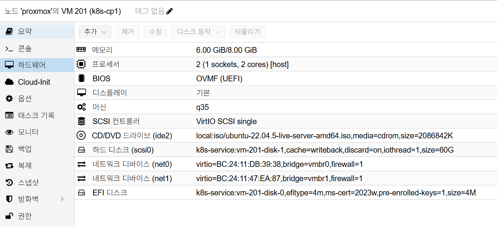
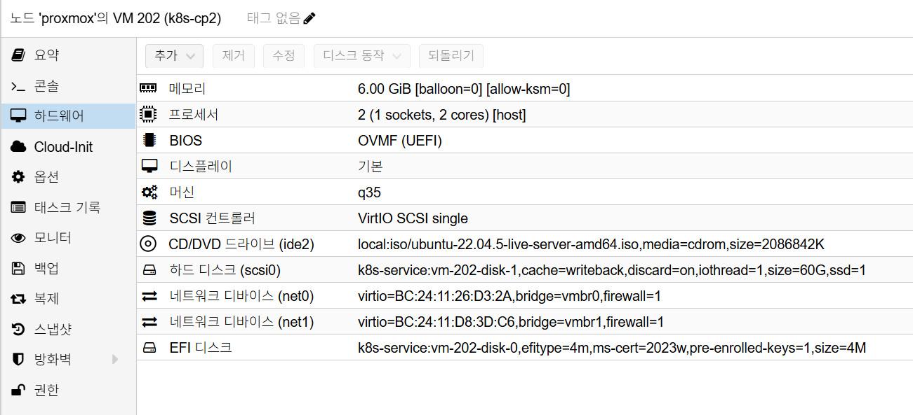
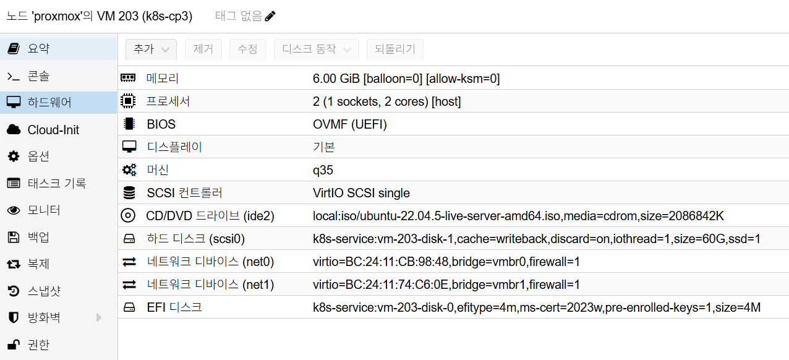
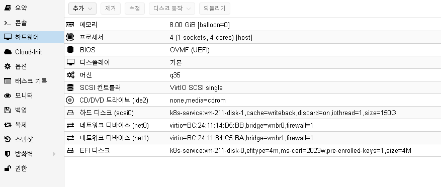
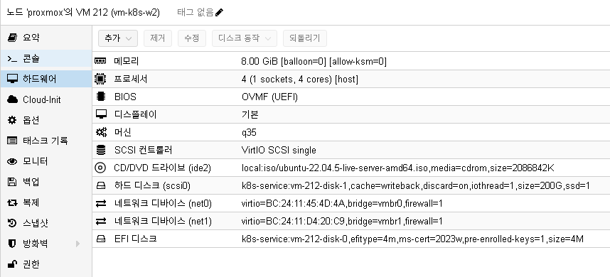

# K8s Installation

## 개요

이 문서는 Proxmox VE 기반 Ubuntu 22.04 환경에서 Kubernetes HA 클러스터를 처음부터 구축하고,
구축 직후 필요한 검증, 백업, 초기 운영 기준까지 한 번에 정리한 기준 문서입니다.

설치가 가장 중요한 기준 문서이므로, VM 생성부터 `kubeadm` 초기화, HA 구성,
설치 직후 점검과 유지보수 시작 전 확인사항까지 이 문서에 포함합니다.

구축 범위:

- Proxmox VM 5대 생성 (`control-plane 3`, `worker 2`)
- `kubeadm` 기반 Kubernetes `v1.29.x` 설치
- `containerd` 런타임 구성
- Cilium CNI 설치
- `kube-vip` 기반 API VIP 구성
- MetalLB + `ingress-nginx` 설치
- etcd 자동 백업(`systemd timer`) 설정
- 설치 직후 검증, 베이스라인 스냅샷, 초기 운영 기준 정리

## 사전 조건

### 설치 전 선택 FAQ

#### 1. Ubuntu Desktop vs Server

- Proxmox VM 기반 Kubernetes 노드는 `Ubuntu Server 22.04 LTS`를 사용합니다.
- Desktop 이미지는 GUI 오버헤드가 커서 운영 표준에서 제외합니다.

권장 ISO 예시:

- `ubuntu-22.04.x-live-server-amd64.iso`

#### 2. SCSI Controller 선택

- Kubernetes VM은 `VirtIO SCSI single`을 권장합니다.
- 디스크 I/O 경합이 줄어들어 control-plane/worker 동시 부하에서 유리합니다.

#### 3. Ubuntu 24.04를 설치했을 때 22.04로 되돌리는 방법

- VM을 새로 만들지 않고 기존 VM에 ISO만 교체해 재설치합니다.
- 설치 중 `Use entire disk`를 선택하면 디스크 내부 데이터가 초기화됩니다.

주의:

- VM 자체(CPU/RAM/NIC 설정)는 유지되지만, 디스크 내부 OS/파일은 삭제됩니다.

## 기준 아키텍처

| 노드 | 역할 | vCPU | RAM | 디스크 | 내부 IP |
| --- | --- | --- | --- | --- | --- |
| vm-k8s-cp1 | control-plane | 2 | 6GB | 60GB | 10.10.10.11 |
| vm-k8s-cp2 | control-plane | 2 | 6GB | 60GB | 10.10.10.12 |
| vm-k8s-cp3 | control-plane | 2 | 6GB | 60GB | 10.10.10.13 |
| vm-k8s-w1 | worker | 4 | 8GB | 200GB | 10.10.10.21 |
| vm-k8s-w2 | worker | 4 | 8GB | 200GB | 10.10.10.22 |
| API VIP | kube-vip | - | - | - | 10.10.10.100 |

네트워크:

- `vmbr0`: 외부망 `192.168.0.0/24`
- `vmbr1`: 내부망 `10.10.10.0/24` (etcd peer/control-plane 전용)

권장 버전:

- Kubernetes `v1.29.x`
- `containerd` (Ubuntu 22.04 기본 패키지)
- `kube-vip` `v0.8.2`
- Cilium `v1.15.5`
- `etcdctl` `v3.5.10`
- MetalLB `v0.14.5`
- `ingress-nginx` controller `v1.11.3`

## 설치 절차

### 대상 노드 표기

- `[모든 노드]`: `cp1`, `cp2`, `cp3`, `w1`, `w2` 전체에 수행
- `[control-plane 공통]`: `cp1`, `cp2`, `cp3`에만 수행
- `[worker 공통]`: `w1`, `w2`에만 수행
- `[cp1 전용]`: `cp1`에서만 수행
- `[cp2/cp3 전용]`: `cp2`, `cp3`에만 수행

### 단계별 적용 대상

| 단계 | 적용 대상 |
| --- | --- |
| 1. Proxmox 사전 준비 | Proxmox 호스트 |
| 2. VM 생성 | VM 5대 전체 |
| 3. Ubuntu 22.04 설치 | `[모든 노드]` |
| 4. 내부망 고정 IP 설정 | `[모든 노드]` |
| 5. 공통 OS 준비 | `[모든 노드]` |
| 6. `containerd` 설치 | `[모든 노드]` |
| 7. `kubeadm`/`kubelet`/`kubectl` 설치 | `[모든 노드]` |
| 8. `cp1` 초기화 | `[cp1 전용]` |
| 9. Control Plane Join | `[cp1 전용]` + `[cp2/cp3 전용]` |
| 10. etcd 3멤버 확인 + `etcdctl` 설치 | `[control-plane 공통]` |
| 11. Worker Join | `[cp1 전용]` + `[worker 공통]` |
| 12. Cilium 설치 | `[cp1 전용]` |
| 13. `kube-vip` 배포 | `[cp1 전용]` + `[control-plane 공통]` |
| 14. MetalLB 설치 | `[cp1 전용]` |
| 15. `ingress-nginx` 설치 | `[cp1 전용]` |
| 16. etcd 자동 백업 설정(운영 권장) | `[cp1 전용]` |

### 1. Proxmox 사전 준비

1. Proxmox VE `8.x` 이상과 Ubuntu ISO(`ubuntu-22.04.5-live-server-amd64.iso`)를 준비합니다.
2. Proxmox UI에서 `vmbr1` 내부 브리지를 생성합니다.
3. `vmbr1`에는 호스트 IP와 물리 NIC를 연결하지 않습니다.

검증:

- Proxmox `Node > Network`에서 `vmbr0`, `vmbr1` 둘 다 존재
- `vmbr1` 상태가 `Active`

### 2. VM 생성

각 VM 공통 권장값:

- Machine: `q35`
- BIOS: `OVMF (UEFI)` + EFI Disk
- SCSI Controller: `VirtIO SCSI single`
- NIC 모델: `VirtIO`
- NIC 2개: `vmbr0` + `vmbr1`
- Ballooning: 비활성화 (`balloon=0`)
- KSM: 비활성화 (`allow-ksm=0`)
- NIC 방화벽: 활성화 (`firewall=1`)

생성 후 반드시 확인:

- VM 5대 모두 NIC 2개 장착
- cp 계열은 `2 vCPU / 6GB RAM / 60GB Disk`
- worker 계열은 `4 vCPU / 8GB RAM / 200GB Disk`

### Proxmox VM H/W 참고 이미지

아래 이미지는 Proxmox `Hardware` 탭 기준의 실제 구성 예시입니다.

- vm-k8s-cp1
  
  캡션: `VM ID 201`, `2 vCPU`, `6GB RAM`, `60GB Disk`, `NIC 2개 (vmbr0 + vmbr1)`,
  `q35`, `OVMF (UEFI)`, `VirtIO SCSI single`, `cache=writeback`, `discard=on`,
  `iothread=1`, `ssd=1`, `balloon=0`, `allow-ksm=0`, `firewall=1`
- vm-k8s-cp2
  
  캡션: `VM ID 202`, `2 vCPU`, `6GB RAM`, `60GB Disk`, `NIC 2개 (vmbr0 + vmbr1)`,
  `q35`, `OVMF (UEFI)`, `VirtIO SCSI single`, `cache=writeback`, `discard=on`,
  `iothread=1`, `ssd=1`, `balloon=0`, `allow-ksm=0`, `firewall=1`
- vm-k8s-cp3
  
  캡션: `VM ID 203`, `2 vCPU`, `6GB RAM`, `60GB Disk`, `NIC 2개 (vmbr0 + vmbr1)`,
  `q35`, `OVMF (UEFI)`, `VirtIO SCSI single`, `cache=writeback`, `discard=on`,
  `iothread=1`, `ssd=1`, `balloon=0`, `allow-ksm=0`, `firewall=1`
- vm-k8s-w1
  
  캡션: `VM ID 211`, `4 vCPU`, `8GB RAM`, `200GB Disk`, `NIC 2개 (vmbr0 + vmbr1)`,
  `q35`, `OVMF (UEFI)`, `VirtIO SCSI single`, `cache=writeback`, `discard=on`,
  `iothread=1`, `ssd=1`, `balloon=0`, `allow-ksm=0`, `firewall=1`
- vm-k8s-w2
  
  캡션: `VM ID 212`, `4 vCPU`, `8GB RAM`, `200GB Disk`, `NIC 2개 (vmbr0 + vmbr1)`,
  `q35`, `OVMF (UEFI)`, `VirtIO SCSI single`, `cache=writeback`, `discard=on`,
  `iothread=1`, `ssd=1`, `balloon=0`, `allow-ksm=0`, `firewall=1`

### 3. Ubuntu 22.04 설치 `[모든 노드]`

모든 VM에서 동일하게 설치합니다.

- 설치 중 네트워크는 NIC 2개 모두 DHCP 유지
- `Install OpenSSH Server` 활성화
- Hostname은 각 노드명으로 지정 (`vm-k8s-cp1` 등)

설치 후 검증:

```bash
ip -br a
```

- `enp6s18`은 외부망 DHCP 주소
- `enp6s19`는 아직 내부 고정 IP 적용 전

### 4. 내부망 고정 IP 설정 `[모든 노드]`

각 노드에서 `/etc/netplan/01-k8s.yaml`을 아래 템플릿으로 생성 후 IP만 변경합니다.

```yaml
network:
  version: 2
  renderer: networkd
  ethernets:
    enp6s18:
      dhcp4: true
    enp6s19:
      dhcp4: no
      addresses:
        - <NODE_INTERNAL_IP>/24
```

적용:

```bash
sudo chmod 600 /etc/netplan/01-k8s.yaml
sudo netplan apply
ip -br a
```

노드별 내부 IP:

- `vm-k8s-cp1`: `10.10.10.11`
- `vm-k8s-cp2`: `10.10.10.12`
- `vm-k8s-cp3`: `10.10.10.13`
- `vm-k8s-w1`: `10.10.10.21`
- `vm-k8s-w2`: `10.10.10.22`

통신 검증 (`cp1` 예시):

```bash
ping -c 3 10.10.10.12
ping -c 3 10.10.10.21
```

내부망 강제 원칙:

- Kubernetes `INTERNAL-IP`는 `vmbr1`(`10.10.10.0/24`) 기준으로 통일합니다.
- 설치 직후 `kubectl get nodes -o wide`에서 외부망(`192.168.0.x`)이 잡히면 `node-ip` 강제 설정을 적용합니다.

### 5. 공통 OS 준비 `[모든 노드]`

#### 5.1 필수 패키지

```bash
sudo apt update
sudo apt install -y curl apt-transport-https ca-certificates gnupg lsb-release
```

#### 5.2 Swap 완전 제거

```bash
sudo swapoff -a
sudo sed -i '/swap/ s/^/# /' /etc/fstab
sudo rm -f /swap.img
swapon --show
```

`swapon --show` 출력이 비어 있어야 합니다.

#### 5.3 커널 모듈

```bash
sudo tee /etc/modules-load.d/k8s.conf >/dev/null <<'EOF2'
overlay
br_netfilter
EOF2
sudo modprobe overlay
sudo modprobe br_netfilter
```

#### 5.4 sysctl

```bash
sudo tee /etc/sysctl.d/k8s.conf >/dev/null <<'EOF2'
net.bridge.bridge-nf-call-iptables = 1
net.bridge.bridge-nf-call-ip6tables = 1
net.ipv4.ip_forward = 1
EOF2
sudo sysctl --system
```

### 6. `containerd` 설치 `[모든 노드]`

```bash
sudo apt update
sudo apt install -y containerd
sudo mkdir -p /etc/containerd
sudo containerd config default | sudo tee /etc/containerd/config.toml >/dev/null
sudo sed -i 's/SystemdCgroup = false/SystemdCgroup = true/' /etc/containerd/config.toml
sudo systemctl restart containerd
sudo systemctl enable containerd
systemctl is-active containerd
```

`systemctl is-active containerd` 결과가 `active`여야 합니다.

### 7. `kubeadm`/`kubelet`/`kubectl` 설치 `[모든 노드]`

```bash
sudo mkdir -p /etc/apt/keyrings
curl -fsSL https://pkgs.k8s.io/core:/stable:/v1.29/deb/Release.key \
| sudo gpg --dearmor -o /etc/apt/keyrings/kubernetes-apt-keyring.gpg
echo "deb [signed-by=/etc/apt/keyrings/kubernetes-apt-keyring.gpg] \
https://pkgs.k8s.io/core:/stable:/v1.29/deb/ /" \
  | sudo tee /etc/apt/sources.list.d/kubernetes.list
sudo apt update
sudo apt install -y kubelet kubeadm kubectl
sudo apt-mark hold kubelet kubeadm kubectl
kubeadm version
```

### 8. `cp1` 초기화 `[cp1 전용]`

`cp1`에서 `/root/kubeadm-init.yaml` 생성:

```yaml
apiVersion: kubeadm.k8s.io/v1beta3
kind: ClusterConfiguration
controlPlaneEndpoint: "10.10.10.11:6443"
apiServer:
  certSANs:
  - 192.168.0.180
  - 192.168.0.181
  - 192.168.0.182
  - 192.168.0.183
  - 10.10.10.11
  - 10.10.10.12
  - 10.10.10.13
  - 10.10.10.100
  - 10.96.0.1
networking:
  podSubnet: "10.244.0.0/16"
---
apiVersion: kubeadm.k8s.io/v1beta3
kind: InitConfiguration
localAPIEndpoint:
  advertiseAddress: "10.10.10.11"
  bindPort: 6443
nodeRegistration:
  kubeletExtraArgs:
    node-ip: "10.10.10.11"
```

초기화:

```bash
sudo kubeadm init --config=/root/kubeadm-init.yaml
```

`kubeadm init` 성공 직후 반드시 확인:

```bash
sudo crictl --runtime-endpoint unix:///run/containerd/containerd.sock ps -a \
  | grep -E 'etcd|kube-apiserver|kube-controller-manager|kube-scheduler'
curl -k https://10.10.10.11:6443/healthz
```

`kubectl` 설정:

```bash
mkdir -p $HOME/.kube
sudo cp /etc/kubernetes/admin.conf $HOME/.kube/config
sudo chown $(id -u):$(id -g) $HOME/.kube/config
kubectl get nodes
```

실행 위치:

- 위 `kubectl` 설정과 검증은 `cp1`에서 먼저 수행합니다.
- `cp2`, `cp3`, `w1`, `w2`에서는 기본 상태로 `kubectl` 실행 시
  `localhost:8080` 연결 오류가 날 수 있으며, 이는 kubeconfig 미설정 상태를 의미합니다.

주의:

- 초기 bootstrap 단계에서는 `controlPlaneEndpoint`를 `cp1`(`10.10.10.11:6443`)로 둡니다.
- `certSANs`에는 내부망 VIP(`10.10.10.100`)를 반드시 포함해야 합니다.
- 외부망 `vm-admin`에서 API를 직접 접근할 계획이면 외부망 IP 또는 외부망 VIP도 `certSANs`에 포함해야 합니다.
- 예를 들어 `192.168.0.181`로 직접 접속하거나
  `192.168.0.180` VIP를 둘 계획이면 해당 주소를 모두
  `certSANs`에 포함해야 TLS 에러를 방지할 수 있습니다.
- 이 시점의 `NotReady`는 정상입니다. 아직 CNI를 설치하지 않았기 때문입니다.
- `kubeadm init` 중 또는 직후에 `https://10.10.10.100:6443`로 붙는 설정을 먼저 넣지 않습니다.
- 아래 조건을 만족하기 전에는 다음 단계로 진행하지 않습니다.

진행 조건:

- `crictl ps -a`에서 `etcd`, `kube-apiserver`, `kube-controller-manager`,
  `kube-scheduler`가 모두 `Running`
- `curl -k https://10.10.10.11:6443/healthz` 결과가 `ok`
- `kubectl get nodes`가 최소 1개 노드(`cp1`)를 반환

실패 시 바로 확인:

```bash
sudo systemctl status kubelet --no-pager -l
sudo journalctl -xeu kubelet --no-pager | tail -n 100
sudo crictl --runtime-endpoint unix:///run/containerd/containerd.sock ps -a
```

### 9. Control Plane Join (`cp2`, `cp3`) `[cp1 전용]` + `[cp2/cp3 전용]`

중요 원칙:

- control-plane join은 VIP(`10.10.10.100`)가 아니라 `cp1`(`10.10.10.11`) 기준으로 진행합니다.
- 내부망 IP를 `advertiseAddress`와 `node-ip`에 명시합니다.
- `kube-vip` 배포 전까지는 `cp1` IP를 bootstrap 기준 엔드포인트로 유지합니다.
- `cp1`에서 API 응답과 `kubectl get nodes`가 정상일 때만 `cp2/cp3` 조인을 시작합니다.

`cp1`에서 준비 (`[cp1 전용]`):

```bash
sudo kubeadm init phase upload-certs --upload-certs
kubeadm token create --print-join-command
```

`cp2` 설정 (`[cp2/cp3 전용]`):

```bash
echo 'KUBELET_EXTRA_ARGS=--node-ip=10.10.10.12' | sudo tee /etc/default/kubelet
sudo systemctl daemon-reload
sudo systemctl restart kubelet
```

`cp2` `/root/join-cp2.yaml`:

```yaml
apiVersion: kubeadm.k8s.io/v1beta3
kind: JoinConfiguration
discovery:
  bootstrapToken:
    apiServerEndpoint: "10.10.10.11:6443"
    token: "<TOKEN>"
    caCertHashes:
      - "sha256:<HASH>"
controlPlane:
  certificateKey: "<CERT_KEY>"
  localAPIEndpoint:
    advertiseAddress: "10.10.10.12"
    bindPort: 6443
nodeRegistration:
  name: "vm-k8s-cp2"
  kubeletExtraArgs:
    node-ip: "10.10.10.12"
```

`cp2` join:

```bash
sudo kubeadm join --config /root/join-cp2.yaml
```

`cp3` 설정 (`[cp2/cp3 전용]`):

```bash
echo 'KUBELET_EXTRA_ARGS=--node-ip=10.10.10.13' | sudo tee /etc/default/kubelet
sudo systemctl daemon-reload
sudo systemctl restart kubelet
```

`cp3` `/root/join-cp3.yaml`:

```yaml
apiVersion: kubeadm.k8s.io/v1beta3
kind: JoinConfiguration
discovery:
  bootstrapToken:
    apiServerEndpoint: "10.10.10.11:6443"
    token: "<TOKEN>"
    caCertHashes:
      - "sha256:<HASH>"
controlPlane:
  certificateKey: "<CERT_KEY>"
  localAPIEndpoint:
    advertiseAddress: "10.10.10.13"
    bindPort: 6443
nodeRegistration:
  name: "vm-k8s-cp3"
  kubeletExtraArgs:
    node-ip: "10.10.10.13"
```

`cp3` join:

```bash
sudo kubeadm join --config /root/join-cp3.yaml
```

`cp2`, `cp3`에서도 `kubectl`을 사용하려면 각 노드에서 kubeconfig를 설정합니다
(`cp2`, `cp3` 각각에서 실행).

```bash
mkdir -p $HOME/.kube
sudo cp /etc/kubernetes/admin.conf $HOME/.kube/config
sudo chown $(id -u):$(id -g) $HOME/.kube/config
kubectl get nodes -o wide
```

설명:

- control-plane 노드는 `/etc/kubernetes/admin.conf`가 존재하므로
  위 절차로 `cp2`, `cp3`에서도 `kubectl`을 바로 사용할 수 있습니다.
- 이 설정을 하지 않으면 `kubectl`이 기본값인 `localhost:8080`으로 접속을 시도해
  연결 오류를 출력할 수 있습니다.

조인 직후 확인 (`[cp1에서 실행]`):

```bash
kubectl get nodes -o wide
```

정상 기준:

- `cp1`, `cp2`, `cp3`가 모두 조회됨
- `INTERNAL-IP`가 `10.10.10.x`
- CNI 설치 전이라 `NotReady`여도 정상

### 10. etcd 3멤버 확인 + `etcdctl` 설치 `[control-plane 공통]`

운영 표준화를 위해 `cp1`, `cp2`, `cp3` 모두에 같은 버전의 `etcdctl`을 설치합니다.
아래 절차는 각 control-plane 노드에서 동일하게 실행합니다.

`etcdctl` 설치 (`[control-plane 공통]`):

```bash
ETCD_VER=v3.5.10
wget https://github.com/etcd-io/etcd/releases/download/${ETCD_VER}/etcd-${ETCD_VER}-linux-amd64.tar.gz
tar xzf etcd-${ETCD_VER}-linux-amd64.tar.gz
sudo mv etcd-${ETCD_VER}-linux-amd64/etcdctl /usr/local/bin/
rm -rf etcd-${ETCD_VER}-linux-amd64 etcd-${ETCD_VER}-linux-amd64.tar.gz
etcdctl version
```

설치 후 멤버 확인은 우선 `cp1`에서 진행합니다.

멤버 확인 (`[cp1 전용]`):

```bash
sudo ETCDCTL_API=3 etcdctl \
  --cacert=/etc/kubernetes/pki/etcd/ca.crt \
  --cert=/etc/kubernetes/pki/etcd/server.crt \
  --key=/etc/kubernetes/pki/etcd/server.key \
  --endpoints=https://127.0.0.1:2379 \
  member list
```

`started` 멤버가 3개여야 합니다.

운영 기준:

- `cp1`, `cp2`, `cp3` 어디서든 로컬 etcd endpoint(`127.0.0.1:2379`) 기준으로
  `endpoint health`, `member list`, `snapshot save`를 바로 실행할 수 있어야 합니다.
- 장애 시 특정 control-plane 노드에 접속 가능한 상황만으로도 즉시 etcd 점검을 시작할 수 있도록
  세 노드 모두 동일 버전으로 유지합니다.

### 11. Worker Join (`w1`, `w2`) `[cp1 전용]` + `[worker 공통]`

`cp1`에서 토큰 생성 (`[cp1 전용]`):

```bash
kubeadm token create --print-join-command
```

각 worker에서 join (`[worker 공통]`):

```bash
sudo kubeadm join 10.10.10.11:6443 \
  --token <TOKEN> \
  --discovery-token-ca-cert-hash sha256:<HASH>
```

worker 내부 IP 고정 (`[worker 공통]`):

```bash
# w1
echo 'KUBELET_EXTRA_ARGS=--node-ip=10.10.10.21' | sudo tee /etc/default/kubelet
# w2
echo 'KUBELET_EXTRA_ARGS=--node-ip=10.10.10.22' | sudo tee /etc/default/kubelet
sudo systemctl daemon-reload
sudo systemctl restart kubelet
```

검증 (`[cp1에서 실행]`):

```bash
kubectl get nodes -o wide
```

`INTERNAL-IP`가 외부망으로 잡힌 경우(예: `192.168.0.x`) 보정:

```bash
# cp1
echo 'KUBELET_EXTRA_ARGS=--node-ip=10.10.10.11' | sudo tee /etc/default/kubelet
# cp2
echo 'KUBELET_EXTRA_ARGS=--node-ip=10.10.10.12' | sudo tee /etc/default/kubelet
# cp3
echo 'KUBELET_EXTRA_ARGS=--node-ip=10.10.10.13' | sudo tee /etc/default/kubelet
# w1
echo 'KUBELET_EXTRA_ARGS=--node-ip=10.10.10.21' | sudo tee /etc/default/kubelet
# w2
echo 'KUBELET_EXTRA_ARGS=--node-ip=10.10.10.22' | sudo tee /etc/default/kubelet
sudo systemctl daemon-reload
sudo systemctl restart kubelet
kubectl get nodes -o wide
```

### 12. Cilium 설치 `[cp1 전용]`

Helm 설치(미설치 시):

```bash
command -v helm >/dev/null 2>&1 || \
  curl https://raw.githubusercontent.com/helm/helm/main/scripts/get-helm-3 | bash
helm version
```

`cp1`에서 Cilium 설치:

```bash
helm repo add cilium https://helm.cilium.io/
helm repo update
helm install cilium cilium/cilium \
  --version 1.15.5 \
  --namespace kube-system \
  --set ipam.mode=kubernetes \
  --set kubeProxyReplacement=true
```

검증:

```bash
kubectl -n kube-system get pods -o wide | egrep 'cilium|coredns'
kubectl get nodes
```

실행 위치:

- 위 검증 명령은 모두 `cp1`에서 실행합니다.

다음 단계 진행 조건:

- `cilium` DaemonSet 파드가 각 노드에서 `Running`
- `coredns` 파드가 `Running`
- `kubectl get nodes`에서 control-plane 노드가 `Ready`

### 13. `kube-vip` 배포 `[cp1 전용]` + `[control-plane 공통]`

`cp1`에서 manifest 생성 (`[cp1 전용]`):

```bash
export VIP=10.10.10.100
export IFACE=enp6s19
sudo ctr image pull ghcr.io/kube-vip/kube-vip:v0.8.2
sudo ctr run --rm --net-host ghcr.io/kube-vip/kube-vip:v0.8.2 \
  vip /kube-vip manifest pod \
  --interface $IFACE \
  --address $VIP \
  --controlplane \
  --services \
  --arp \
  --leaderElection \
| sudo tee /tmp/kube-vip.yaml
```

`cp1` 로컬 적용 (`[cp1 전용]`):

```bash
sudo cp /tmp/kube-vip.yaml /etc/kubernetes/manifests/kube-vip.yaml
```

설명:

- `/etc/kubernetes/manifests/kube-vip.yaml`은 static pod manifest 경로입니다.
- 파일을 이 경로에 복사하면 kubelet이 자동으로 감지하여 `kube-vip`를 실행합니다.
- 별도의 `kubectl apply`는 하지 않습니다.

`cp2`, `cp3` 원격 복사 및 적용 (`[control-plane 공통]`):

```bash
scp /tmp/kube-vip.yaml semtl@10.10.10.12:/tmp/kube-vip.yaml
scp /tmp/kube-vip.yaml semtl@10.10.10.13:/tmp/kube-vip.yaml

ssh -t semtl@10.10.10.12 "sudo cp /tmp/kube-vip.yaml /etc/kubernetes/manifests/kube-vip.yaml"
ssh -t semtl@10.10.10.13 "sudo cp /tmp/kube-vip.yaml /etc/kubernetes/manifests/kube-vip.yaml"
```

주의:

- `cp2`, `cp3`에는 control-plane join 완료 후에만 `/etc/kubernetes/manifests/`에 복사합니다.
- `cp1`만 초기화된 상태에서는 `cp1`에 먼저 적용한 뒤, `cp2/cp3` 조인 완료 후 동일 파일을 복사합니다.
- 위 예시는 `cp1`에서 실행하는 기준입니다.
- 원격 사용자 계정이 `semtl`이 아니면 해당 계정명으로 바꿉니다.

`cp1`에서 RBAC 적용 파일 `/tmp/kube-vip-rbac.yaml` 생성:

```bash
cat >/tmp/kube-vip-rbac.yaml <<'EOF'
apiVersion: v1
kind: ServiceAccount
metadata:
  name: kube-vip
  namespace: kube-system
---
apiVersion: rbac.authorization.k8s.io/v1
kind: ClusterRole
metadata:
  name: kube-vip-role
rules:
- apiGroups: [""]
  resources: ["services","endpoints","nodes","pods"]
  verbs: ["get","list","watch"]
- apiGroups: ["coordination.k8s.io"]
  resources: ["leases"]
  verbs: ["get","list","watch","create","update","patch"]
---
apiVersion: rbac.authorization.k8s.io/v1
kind: ClusterRoleBinding
metadata:
  name: kube-vip-binding
roleRef:
  apiGroup: rbac.authorization.k8s.io
  kind: ClusterRole
  name: kube-vip-role
subjects:
- kind: ServiceAccount
  name: kube-vip
  namespace: kube-system
EOF
```

```bash
kubectl apply -f /tmp/kube-vip-rbac.yaml
```

`kubeconfig`를 VIP로 전환:

```bash
sudo sed -i "s#server: https://.*:6443#server: https://10.10.10.100:6443#g" $HOME/.kube/config
kubectl cluster-info
kubectl get nodes
```

실행 위치:

- 위 `kubectl` 명령은 모두 `cp1`에서 실행합니다.

VIP 확인:

```bash
ip -br a | grep 10.10.10.100
```

`kube-vip` 배포 후 `kubeadm-config`도 VIP 기준으로 맞춥니다.

```bash
kubectl -n kube-system get cm kubeadm-config \
  -o jsonpath='{.data.ClusterConfiguration}' > /tmp/kubeadm-config.yaml
sudo sed -i \
  's/controlPlaneEndpoint: 10.10.10.11:6443/'\
'controlPlaneEndpoint: 10.10.10.100:6443/' \
  /tmp/kubeadm-config.yaml
kubectl -n kube-system create configmap kubeadm-config \
  --from-file=ClusterConfiguration=/tmp/kubeadm-config.yaml \
  -o yaml --dry-run=client | kubectl apply -f -
```

확인:

```bash
kubectl -n kube-system get cm kubeadm-config -o yaml | grep controlPlaneEndpoint
```

정상 기준:

- `ip -br a | grep 10.10.10.100` 결과가 control-plane 중 1대에서 확인됨
- `kubectl cluster-info`가 VIP 기준으로 응답
- `kubeadm-config`의 `controlPlaneEndpoint`가 `10.10.10.100:6443`

### 14. 외부 API Endpoint HA 구성 `[ct-lb1/lb2 전용]`

내부 control-plane HA는 `kube-vip`(`10.10.10.100`)로 유지하고,
외부 운영 접속은 별도 LB CT 2대로 분리해야 합니다.

권장 구조:

```text
VM-ADMIN (192.168.0.41)
        |
        v
K8s API VIP (192.168.0.180:6443)
        |
   +----+----+
   |         |
CT-LB1    CT-LB2
192.168.0.161
192.168.0.162
(HAProxy + Keepalived)
        |
        v
CP1 192.168.0.181:6443
CP2 192.168.0.182:6443
CP3 192.168.0.183:6443
```

구성 원칙:

- `kube-vip`는 control-plane 내부 API HA용입니다.
- `CT-LB1/CT-LB2 + Keepalived + HAProxy`는 외부 운영 접속용입니다.
- `vm-admin`의 kubeconfig는 최종적으로 `192.168.0.180:6443`를 사용해야 합니다.
- 외부망 VIP `192.168.0.180`은 apiserver `certSANs`에 포함되어 있어야 합니다.

#### 14.1 CT 권장 리소스

- OS: `Ubuntu 22.04`
- vCPU: `1`
- RAM: `512MB`
- Disk: `8GB`
- NIC: 외부망 `192.168.0.x`

예시:

- `ct-lb1`: `192.168.0.161`
- `ct-lb2`: `192.168.0.162`
- API VIP: `192.168.0.180`

#### 14.2 Proxmox CT 생성

Proxmox에서 Ubuntu 22.04 LXC 템플릿을 준비한 뒤 CT 2개를 생성해야 합니다.

예시:

- `ct-lb1`
  - CT ID: `121`
  - Hostname: `ct-lb1`
  - IP: `192.168.0.161/24`
  - Gateway: 외부망 기본 게이트웨이
- `ct-lb2`
  - CT ID: `122`
  - Hostname: `ct-lb2`
  - IP: `192.168.0.162/24`
  - Gateway: 외부망 기본 게이트웨이

권장 옵션:

- Unprivileged CT 사용
- `nesting=1` 불필요
- 방화벽 사용 시 `6443`, VRRP, 관리 SSH 경로 확인
- 두 CT 모두 같은 브리지(`vmbr0`)에 연결

생성 후 공통 확인:

```bash
hostnamectl
ip -br a
ip route
ping -c 2 192.168.0.181
ping -c 2 192.168.0.182
ping -c 2 192.168.0.183
```

#### 14.3 CT 공통 초기 설정

Proxmox CT는 기본 상태에서 `root` SSH 접근이 제한될 수 있습니다.
따라서 콘솔로 먼저 접속한 뒤 운영 계정 `semtl`을 만들고 `sudo` 권한을 부여해야 합니다.

운영 계정 생성:

```bash
apt update
apt install -y sudo openssh-server
adduser semtl
usermod -aG sudo semtl
id semtl
```

운영 기준:

- 이후 SSH 접속과 운영 명령은 `semtl` 계정 기준으로 진행해야 합니다.
- `root` 직접 SSH 접속을 열기보다 `semtl` + `sudo` 조합으로 운영해야 합니다.

필요 시 SSH 서비스 확인:

```bash
systemctl enable --now ssh
systemctl status ssh --no-pager
```

접속 확인 예시:

```bash
ssh semtl@192.168.0.161
ssh semtl@192.168.0.162
sudo whoami
```

두 CT 모두 아래 패키지를 설치해야 합니다.

```bash
sudo apt update
sudo apt install -y haproxy keepalived curl netcat-openbsd
```

권장 추가 확인:

```bash
haproxy -v
keepalived --version
nc -vz 192.168.0.181 6443
nc -vz 192.168.0.182 6443
nc -vz 192.168.0.183 6443
```

정상 기준:

- 세 control-plane의 `6443` 포트가 두 CT에서 모두 열려 있어야 합니다.
- 이 단계에서 연결이 안 되면 HAProxy/Keepalived 설정 전 네트워크를 먼저 수정해야 합니다.

#### 14.4 HAProxy 설정

두 CT 모두 `/etc/haproxy/haproxy.cfg`에 맨 아래에 추가해야 합니다.

```cfg
 ...

frontend k8s_api
  bind *:6443
  mode tcp
  option tcplog
  default_backend k8s_api_back

backend k8s_api_back
  mode tcp
  option tcp-check
  balance roundrobin
  default-server inter 2s fall 2 rise 2
  server cp1 192.168.0.181:6443 check
  server cp2 192.168.0.182:6443 check
  server cp3 192.168.0.183:6443 check
```

적용:

```bash
sudo systemctl enable --now haproxy
sudo systemctl restart haproxy
sudo systemctl status haproxy --no-pager
```

백엔드 연결 확인:

```bash
nc -vz 192.168.0.181 6443
nc -vz 192.168.0.182 6443
nc -vz 192.168.0.183 6443
```

세 개 모두 `succeeded`가 나와야 정상입니다.

#### 14.5 Keepalived 설정

`ct-lb1`는 `MASTER`, `ct-lb2`는 `BACKUP`으로 구성해야 합니다.

인터페이스 확인:

```bash
ip -br a
```

아래 예시에서는 `eth0`를 사용합니다. 실제 인터페이스 이름이 다르면 해당 이름으로 바꿔야 합니다.

헬스체크 스크립트는 두 CT에 동일하게 배치해야 합니다.

```bash
sudo tee /usr/local/bin/check_haproxy.sh >/dev/null <<'EOF'
#!/bin/sh
systemctl is-active --quiet haproxy
EOF
sudo chmod +x /usr/local/bin/check_haproxy.sh
```

`ct-lb1` 예시 `/etc/keepalived/keepalived.conf`:

```cfg
vrrp_script chk_haproxy {
  script "/usr/local/bin/check_haproxy.sh"
  interval 2
  fall 2
  rise 2
}

vrrp_instance VI_K8S_API {
  state MASTER
  interface eth0
  virtual_router_id 51
  priority 120
  advert_int 1
  unicast_src_ip 192.168.0.161
  unicast_peer {
    192.168.0.162
  }
  authentication {
    auth_type PASS
    auth_pass K8sVip51!
  }
  virtual_ipaddress {
    192.168.0.180/24
  }
  track_script {
    chk_haproxy
  }
}
```

`ct-lb2` 예시 `/etc/keepalived/keepalived.conf`:

```cfg
vrrp_script chk_haproxy {
  script "/usr/local/bin/check_haproxy.sh"
  interval 2
  fall 2
  rise 2
}

vrrp_instance VI_K8S_API {
  state BACKUP
  interface eth0
  virtual_router_id 51
  priority 110
  advert_int 1
  unicast_src_ip 192.168.0.162
  unicast_peer {
    192.168.0.161
  }
  authentication {
    auth_type PASS
    auth_pass K8sVip51!
  }
  virtual_ipaddress {
    192.168.0.180/24
  }
  track_script {
    chk_haproxy
  }
}
```

적용:

```bash
sudo systemctl enable --now keepalived
sudo systemctl restart keepalived
sudo systemctl status keepalived --no-pager
```

#### 14.6 외부 API VIP 확인

VIP는 두 CT 중 한 대에만 보여야 합니다.

```bash
ip a | grep 192.168.0.180
```

`vm-admin`에서 VIP 포트 확인:

```bash
nc -vz 192.168.0.180 6443
```

정상 기준:

- `192.168.0.180` VIP가 `ct-lb1` 또는 `ct-lb2` 한 대에만 바인딩됨
- `nc -vz 192.168.0.180 6443` 연결 성공

#### 14.7 `vm-admin` kubeconfig 전환

외부 운영 접속은 VIP 기준으로 통일해야 합니다.

```bash
cp ~/.kube/config ~/.kube/config.bak
sed -i \
  's#server: https://.*:6443#server: https://192.168.0.180:6443#g' \
  ~/.kube/config
grep server ~/.kube/config
kubectl get nodes -o wide
```

`x509` 오류가 발생하면 apiserver 인증서 SAN에 `192.168.0.180`이 포함되어 있는지 확인해야 합니다.
상세 절차는 이 문서의 `apiserver SAN 변경 반영` 섹션을 따라야 합니다.

#### 14.8 장애 시 기대 동작

- `ct-lb1` 장애:
  VIP가 `ct-lb2`로 이동해야 합니다.
- `cp1` 장애:
  HAProxy가 `cp2/cp3`로 트래픽을 전달해야 합니다.
- `ct-lb1/ct-lb2` 동시 장애:
  클러스터는 계속 동작하지만 외부 `kubectl` 접속은 불가합니다.

### 15. MetalLB 설치 `[cp1 전용]`

설치:

```bash
kubectl apply -f https://raw.githubusercontent.com/metallb/metallb/v0.14.5/config/manifests/metallb-native.yaml
```

`cp1`에서 IP 풀 파일 `/tmp/metallb-pool.yaml` 생성:

```bash
cat >/tmp/metallb-pool.yaml <<'EOF'
apiVersion: metallb.io/v1beta1
kind: IPAddressPool
metadata:
  name: default-pool
  namespace: metallb-system
spec:
  addresses:
  - 192.168.0.200-192.168.0.220
---
apiVersion: metallb.io/v1beta1
kind: L2Advertisement
metadata:
  name: default-l2
  namespace: metallb-system
spec:
  ipAddressPools:
  - default-pool
EOF
```

적용:

```bash
kubectl apply -f /tmp/metallb-pool.yaml
kubectl -n metallb-system get pods
```

### 15. `ingress-nginx` 설치 `[cp1 전용]`

```bash
kubectl apply -f https://raw.githubusercontent.com/kubernetes/ingress-nginx/controller-v1.11.3/deploy/static/provider/cloud/deploy.yaml
kubectl -n ingress-nginx get pods
```

정상 기준:

- `ingress-nginx-controller` 파드는 `Running`
- `ingress-nginx-admission-create`, `ingress-nginx-admission-patch` Job 파드는
  1회 실행 후 `Completed` 상태로 남아 있어도 정상

### 16. etcd 자동 백업 설정(운영 권장) `[cp1 전용]`

이 단계는 랩/테스트 클러스터에서는 선택 사항이지만, 실제 운영 클러스터에서는 기본 적용을 권장합니다.

위치는 현재 순서가 적절합니다.

- 최소한 control-plane 구성, CNI, `kube-vip`, `ingress-nginx`까지 설치가 끝난 뒤
  클러스터가 안정화된 상태에서 백업 자동화를 거는 편이 운영상 안전합니다.
- 다만 etcd snapshot 자체는 더 이른 시점에도 가능하므로, 운영 환경에서는 이 단계 전이라도
  수동 백업 1회를 먼저 수행해 두면 더 안전합니다.

백업 디렉터리:

```bash
sudo mkdir -p /var/backups/etcd
sudo chmod 700 /var/backups/etcd
```

백업 스크립트 `/usr/local/bin/etcd-backup.sh`:

```bash
#!/usr/bin/env bash
set -euo pipefail
BACKUP_DIR=/var/backups/etcd
TS=$(date -u +%Y%m%dT%H%M%SZ)
FILE="${BACKUP_DIR}/etcd-${TS}.db"

ETCDCTL_API=3 etcdctl \
  --cacert=/etc/kubernetes/pki/etcd/ca.crt \
  --cert=/etc/kubernetes/pki/etcd/server.crt \
  --key=/etc/kubernetes/pki/etcd/server.key \
  --endpoints=https://127.0.0.1:2379 \
  snapshot save "${FILE}"

ls -1t ${BACKUP_DIR}/etcd-*.db | tail -n +31 | xargs -r rm -f
```

권한:

```bash
sudo chmod 700 /usr/local/bin/etcd-backup.sh
```

- `700`은 스크립트 소유자만 읽기/쓰기/실행 가능하고, 그룹/기타 사용자는 접근할 수 없다는 뜻입니다.

서비스 `/etc/systemd/system/etcd-backup.service`:

```ini
[Unit]
Description=Kubernetes etcd snapshot backup
After=network-online.target

[Service]
Type=oneshot
ExecStart=/usr/local/bin/etcd-backup.sh
```

타이머 `/etc/systemd/system/etcd-backup.timer`:

```ini
[Unit]
Description=Run etcd backup daily (UTC)

[Timer]
OnCalendar=*-*-* 00:00:00 UTC
Persistent=true
Unit=etcd-backup.service

[Install]
WantedBy=timers.target
```

활성화:

```bash
sudo systemctl daemon-reload
sudo systemctl enable --now etcd-backup.timer
systemctl list-timers | grep etcd-backup
sudo systemctl start etcd-backup.service
sudo ls -lh /var/backups/etcd
```

## 설치 검증

### 최종 검증

필수 검증 항목:

1. `kubectl get nodes -o wide`에서 5노드 모두 `Ready`
2. `control-plane` 노드 중 1대 이상에서 `etcdctl member list` 결과 `started` 3개
3. `kubectl -n kube-system get pods`에서 `cilium`/`coredns`/`kube-vip` 정상
4. `ip -br a | grep 10.10.10.100`로 VIP 확인
5. MetalLB와 `ingress-nginx` 파드가 `Running`
6. `systemctl list-timers | grep etcd-backup`로 백업 타이머 활성 확인

권장 확인 명령:

```bash
kubectl get nodes -o wide
kubectl get pods -A
kubectl get events -A --sort-by=.metadata.creationTimestamp | tail -n 50
sudo ETCDCTL_API=3 etcdctl \
  --cacert=/etc/kubernetes/pki/etcd/ca.crt \
  --cert=/etc/kubernetes/pki/etcd/server.crt \
  --key=/etc/kubernetes/pki/etcd/server.key \
  --endpoints=https://127.0.0.1:2379 \
  endpoint health
```

판단 기준:

- `kubectl get nodes -o wide`에서 5노드 모두 `Ready`
- `kubectl get pods -A`에서 핵심 파드가 현재 시점 기준 `Running`
  - `cilium`
  - `coredns`
  - `etcd`
  - `kube-apiserver`
  - `kube-controller-manager`
  - `kube-scheduler`
  - `kube-vip`
  - `metallb`
  - `ingress-nginx-controller`
- `etcdctl endpoint health`는 각 control-plane 노드의 로컬 etcd endpoint
  (`127.0.0.1:2379`)가 정상 응답하는지 확인하는 용도입니다.
- `kubectl get events -A`에는 설치 중 일시 경고가 남아 있을 수 있으므로,
  현재 파드/서비스 상태와 함께 판단합니다.
- 예를 들어 초기 설치 직후의 `FailedMount`, `BackOff pulling image`,
  `ImagePullBackOff`, `FailedToStartServiceHealthcheck` 이벤트는 뒤이어
  `Pulled`, `Started`, `Completed`, `Assigned IP`가 확인되면 일시 경고로 볼 수 있습니다.
- 반대로 동일 경고가 계속 누적되거나 현재 시점에도 파드가 `Pending`,
  `CrashLoopBackOff`, `ImagePullBackOff`이면 원인 분석이 필요합니다.

## 스냅샷 전 권장 추가 구성

### metrics-server 설치 `[cp1 전용]`

`metrics-server`는 클러스터 기본 기동에 필수는 아니지만, 운영 편의상 설치를 권장합니다.

- `kubectl top nodes`
- `kubectl top pods -A`
- HPA 사용

설치 시점:

- `cp1/cp2/cp3`, `w1/w2` 조인 완료 후
- CNI, `kube-vip`, MetalLB, `ingress-nginx`까지 안정화된 뒤
- 베이스라인 스냅샷 전에 포함하면 복원 직후 운영 점검이 더 편리함

설치:

```bash
kubectl apply -f https://github.com/kubernetes-sigs/metrics-server/releases/latest/download/components.yaml
kubectl -n kube-system patch deployment metrics-server \
  --type='json' \
  -p='[{"op":"add","path":"/spec/template/spec/containers/0/args/-","value":"--kubelet-insecure-tls"}]'
kubectl -n kube-system rollout status deployment/metrics-server
kubectl -n kube-system get pods | grep metrics-server
```

확인:

```bash
kubectl top nodes
kubectl top pods -A | head -n 30
kubectl describe node vm-k8s-w1 | egrep -i 'MemoryPressure|DiskPressure|PIDPressure|Ready'
```

참고:

- 이 환경에서는 kubelet 인증서의 IP SAN 이슈를 피하기 위해 `--kubelet-insecure-tls`를 함께 적용합니다.
- `metrics-server`는 Kubernetes Metrics API용 경량 컴포넌트이고, Prometheus를 대체하지 않습니다.
- Prometheus는 장기 보관, 시계열 조회, Alertmanager 연동,
  Grafana 시각화용입니다.
- `metrics-server`는 실시간에 가까운 리소스 사용량 조회와
  HPA용입니다.

### 스냅샷 베이스라인

최종 검증과 `metrics-server` 설치까지 완료한 뒤 VM 5대 종료 상태에서 Proxmox 스냅샷을 생성합니다.

권장 사항:

- 운영용 베이스라인 스냅샷은 `metrics-server` 포함 상태로 생성하는 것을 권장합니다.
- 이렇게 하면 스냅샷 복원 직후 `kubectl top nodes`, `kubectl top pods -A`로 기본 리소스 점검이 가능합니다.
- 최소 설치 상태만 보존하려는 목적이면 `metrics-server` 없이 스냅샷을 생성해도 됩니다.

스냅샷 생성 전 아래 정리 작업을 먼저 수행합니다.

```bash
sudo rm -rf /tmp/*
sudo rm -rf /var/tmp/*
sudo apt autoremove -y
sudo apt clean
sudo journalctl --vacuum-time=1s
cat /dev/null > ~/.bash_history && history -c
```

권장 스냅샷 이름:

- `k8s-ha-install-clean-v1`

권장 적용 방식:

- 스냅샷 이름은 5대 VM 모두 동일하게 `k8s-ha-install-clean-v1`로 맞춥니다.
- 설명(description)은 노드 역할이 드러나도록 VM별로 다르게 기록합니다.

VM별 권장 설명:

- `vm-k8s-cp1`:
  `[설치]`
  `- k8s : v1.29.15`
  `- role : control-plane-1`
  `- hostname : vm-k8s-cp1`
  `- internal ip : 10.10.10.11`
  `- bootstrap : kubeadm init 완료`
  `- vip : 10.10.10.100:6443`
  `- addons : cilium, metallb, ingress-nginx, kube-vip, metrics-server`
  `- etcd : backup configured`
- `vm-k8s-cp2`:
  `[설치]`
  `- k8s : v1.29.15`
  `- role : control-plane-2`
  `- hostname : vm-k8s-cp2`
  `- internal ip : 10.10.10.12`
  `- join : control-plane join 완료`
  `- kubeconfig : configured`
  `- etcdctl : installed`
  `- metrics : metrics-server available`
  `- kube-vip : static manifest applied`
- `vm-k8s-cp3`:
  `[설치]`
  `- k8s : v1.29.15`
  `- role : control-plane-3`
  `- hostname : vm-k8s-cp3`
  `- internal ip : 10.10.10.13`
  `- join : control-plane join 완료`
  `- kubeconfig : configured`
  `- etcdctl : installed`
  `- metrics : metrics-server available`
  `- kube-vip : static manifest applied`
- `vm-k8s-w1`:
  `[설치]`
  `- k8s : v1.29.15`
  `- role : worker-1`
  `- hostname : vm-k8s-w1`
  `- internal ip : 10.10.10.21`
  `- join : worker join 완료`
  `- cni : cilium ready`
  `- metrics : metrics-server available`
  `- ingress : traffic ready`
- `vm-k8s-w2`:
  `[설치]`
  `- k8s : v1.29.15`
  `- role : worker-2`
  `- hostname : vm-k8s-w2`
  `- internal ip : 10.10.10.22`
  `- join : worker join 완료`
  `- cni : cilium ready`
  `- metrics : metrics-server available`
  `- ingress : traffic ready`

## 설치 직후 운영 기준

### 일일 점검

```bash
kubectl get nodes -o wide
kubectl get pods -A
kubectl get events -A --sort-by=.metadata.creationTimestamp | tail -n 50
```

확인 항목:

- 모든 노드 `Ready`
- `kube-system`, `metallb-system`, `ingress-nginx` 주요 파드 `Running`
- 반복 `CrashLoopBackOff`, `ImagePullBackOff` 발생 여부

### 주간 점검

#### etcd 상태

```bash
sudo ETCDCTL_API=3 etcdctl \
  --cacert=/etc/kubernetes/pki/etcd/ca.crt \
  --cert=/etc/kubernetes/pki/etcd/server.crt \
  --key=/etc/kubernetes/pki/etcd/server.key \
  --endpoints=https://127.0.0.1:2379 \
  endpoint health

sudo ETCDCTL_API=3 etcdctl \
  --cacert=/etc/kubernetes/pki/etcd/ca.crt \
  --cert=/etc/kubernetes/pki/etcd/server.crt \
  --key=/etc/kubernetes/pki/etcd/server.key \
  --endpoints=https://127.0.0.1:2379 \
  member list
```

#### VIP 상태

```bash
ip -br a | grep 10.10.10.100
kubectl -n kube-system get pods -o wide | grep kube-vip
```

#### 노드 IP 정합성

```bash
kubectl get nodes -o wide
```

#### 백업 상태

```bash
systemctl list-timers | grep etcd-backup
sudo ls -lh /var/backups/etcd | tail -n 10
```

#### 용량 및 압력 점검

```bash
kubectl top nodes
kubectl top pods -A | head -n 30
kubectl describe node vm-k8s-w1 | egrep -i 'MemoryPressure|DiskPressure|PIDPressure|Ready'
```

### 월간 점검

#### HA 페일오버 테스트

1. 현재 VIP 보유 노드를 확인합니다.
2. 해당 control-plane 노드를 종료합니다.
3. 10초에서 30초 내 VIP 이동 여부를 확인합니다.
4. API 응답과 노드 상태가 정상인지 확인합니다.

확인 명령:

```bash
ip -br a | grep 10.10.10.100
kubectl cluster-info
kubectl get nodes
```

#### 인증서 만료 점검

```bash
sudo kubeadm certs check-expiration
```

만료 임박 시(예: 30일 이내) 갱신:

```bash
sudo kubeadm certs renew all
sudo systemctl restart kubelet
```

#### apiserver SAN 변경 반영

외부망 `vm-admin`에서 `192.168.0.x` 대역으로 API에 직접 접근해야 한다면
apiserver 인증서 SAN에 외부망 IP 또는 외부망 VIP를 포함해야 합니다.

예를 들어 아래와 같은 오류가 발생하면 SAN 재발급이 필요합니다.

```text
tls: failed to verify certificate: x509: certificate is valid for
10.96.0.1, 10.10.10.11, 10.10.10.12, 10.10.10.13, 10.10.10.100,
not 192.168.0.181
```

적용 순서는 다음과 같이 진행해야 합니다.

1. `cp1`에서 새 `ClusterConfiguration` 기준 파일을 준비해야 합니다.
2. `kubeadm-config` ConfigMap을 새 설정으로 업로드해야 합니다.
3. 각 control-plane 노드에서 `apiserver` 인증서를 다시 생성해야 합니다.
4. 각 노드에서 SAN 반영 여부를 확인해야 합니다.

참고:

- `10.96.0.1`은 기본 Kubernetes Service IP이므로 실제 인증서 SAN에 포함될 수 있습니다.
- 이 값은 `kubeadm`이 `serviceSubnet` 기준으로 자동 포함하는 항목이므로
  `certSANs`에 직접 적지 않아도 됩니다.
- 문서의 `certSANs`에는 운영자가 추가로 보장해야 하는 내부망/외부망/VIP 주소를 중심으로 정리합니다.

##### 1) `cp1` 재발급용 설정 파일

`cp1`에서 `/root/kubeadm-san-update-cp1.yaml` 생성:

```yaml
apiVersion: kubeadm.k8s.io/v1beta3
kind: ClusterConfiguration
controlPlaneEndpoint: "10.10.10.11:6443"
apiServer:
  certSANs:
  - 192.168.0.180
  - 192.168.0.181
  - 192.168.0.182
  - 192.168.0.183
  - 10.10.10.11
  - 10.10.10.12
  - 10.10.10.13
  - 10.10.10.100
networking:
  podSubnet: "10.244.0.0/16"
---
apiVersion: kubeadm.k8s.io/v1beta3
kind: InitConfiguration
localAPIEndpoint:
  advertiseAddress: "10.10.10.11"
  bindPort: 6443
nodeRegistration:
  kubeletExtraArgs:
    node-ip: "10.10.10.11"
```

##### 2) `cp2` 재발급용 설정 파일

`cp2`에서 `/root/kubeadm-san-update-cp2.yaml` 생성:

```yaml
apiVersion: kubeadm.k8s.io/v1beta3
kind: ClusterConfiguration
controlPlaneEndpoint: "10.10.10.11:6443"
apiServer:
  certSANs:
  - 192.168.0.180
  - 192.168.0.181
  - 192.168.0.182
  - 192.168.0.183
  - 10.10.10.11
  - 10.10.10.12
  - 10.10.10.13
  - 10.10.10.100
  - 10.96.0.1
networking:
  podSubnet: "10.244.0.0/16"
---
apiVersion: kubeadm.k8s.io/v1beta3
kind: InitConfiguration
localAPIEndpoint:
  advertiseAddress: "10.10.10.12"
  bindPort: 6443
nodeRegistration:
  kubeletExtraArgs:
    node-ip: "10.10.10.12"
```

##### 3) `cp3` 재발급용 설정 파일

`cp3`에서 `/root/kubeadm-san-update-cp3.yaml` 생성:

```yaml
apiVersion: kubeadm.k8s.io/v1beta3
kind: ClusterConfiguration
controlPlaneEndpoint: "10.10.10.11:6443"
apiServer:
  certSANs:
  - 192.168.0.180
  - 192.168.0.181
  - 192.168.0.182
  - 192.168.0.183
  - 10.10.10.11
  - 10.10.10.12
  - 10.10.10.13
  - 10.10.10.100
networking:
  podSubnet: "10.244.0.0/16"
---
apiVersion: kubeadm.k8s.io/v1beta3
kind: InitConfiguration
localAPIEndpoint:
  advertiseAddress: "10.10.10.13"
  bindPort: 6443
nodeRegistration:
  kubeletExtraArgs:
    node-ip: "10.10.10.13"
```

##### 4) `kubeadm-config` 업로드

`cp1`에서 실행:

```bash
sudo kubeadm init phase upload-config kubeadm \
  --config /root/kubeadm-san-update-cp1.yaml
```

##### 5) 각 control-plane에서 `apiserver` 인증서 재생성

주의:

- `sudo kubeadm certs renew apiserver --config ...`만으로는
  새 `certSANs`가 반영되지 않을 수 있습니다.
- 실제 검증에서는 `renew` 후에도 SAN이 기존 값으로 유지되었습니다.
- 따라서 기존 `apiserver.crt`와 `apiserver.key`를 백업한 뒤
  `init phase certs apiserver --config ...`로 다시 생성해야 합니다.

작업 전 백업:

```bash
sudo cp /etc/kubernetes/pki/apiserver.crt /etc/kubernetes/pki/apiserver.crt.bak
sudo cp /etc/kubernetes/pki/apiserver.key /etc/kubernetes/pki/apiserver.key.bak
```

`cp1`:

```bash
sudo mv /etc/kubernetes/pki/apiserver.crt /etc/kubernetes/pki/apiserver.crt.old
sudo mv /etc/kubernetes/pki/apiserver.key /etc/kubernetes/pki/apiserver.key.old

sudo kubeadm init phase certs apiserver \
  --config /root/kubeadm-san-update-cp1.yaml
sudo systemctl restart kubelet
```

`cp2`:

```bash
sudo mv /etc/kubernetes/pki/apiserver.crt /etc/kubernetes/pki/apiserver.crt.old
sudo mv /etc/kubernetes/pki/apiserver.key /etc/kubernetes/pki/apiserver.key.old

sudo kubeadm init phase certs apiserver \
  --config /root/kubeadm-san-update-cp2.yaml
sudo systemctl restart kubelet
```

`cp3`:

```bash
sudo mv /etc/kubernetes/pki/apiserver.crt /etc/kubernetes/pki/apiserver.crt.old
sudo mv /etc/kubernetes/pki/apiserver.key /etc/kubernetes/pki/apiserver.key.old

sudo kubeadm init phase certs apiserver \
  --config /root/kubeadm-san-update-cp3.yaml
sudo systemctl restart kubelet
```

##### 6) SAN 반영 확인

각 control-plane 노드에서 확인:

```bash
sudo openssl x509 -in /etc/kubernetes/pki/apiserver.crt -noout -text \
  | grep -A1 "Subject Alternative Name"
```

최소 아래 주소가 보여야 합니다.

- `192.168.0.180`
- `192.168.0.181`
- `192.168.0.182`
- `192.168.0.183`
- `10.10.10.11`
- `10.10.10.12`
- `10.10.10.13`
- `10.10.10.100`

만약 아래 주소가 보이지 않으면 SAN 반영이 실패한 것입니다.

- `192.168.0.180`
- `192.168.0.181`
- `192.168.0.182`
- `192.168.0.183`

##### 7) `vm-admin`에서 최종 확인

```bash
kubectl get nodes -o wide
```

참고:

- `controlPlaneEndpoint`는 기존 bootstrap 기준을 유지해도 됩니다.
- 외부망 운영 접속이 목적이라면 핵심은 `certSANs` 반영입니다.
- 최종적으로는 `192.168.0.180` 같은 외부망 VIP를 구성하고
  해당 VIP로 운영 접근을 통일하는 편이 좋습니다.

## 유지보수 및 변경 표준

### 변경 작업 표준

1. 작업 전 etcd 스냅샷을 수동으로 1회 생성합니다.
2. 변경 대상과 영향 노드를 먼저 명시합니다.
3. 단일 변경 단위로 적용한 뒤 상태를 확인합니다.
4. 이상이 있으면 즉시 롤백합니다.

수동 etcd 백업:

```bash
sudo systemctl start etcd-backup.service
sudo ls -lh /var/backups/etcd | tail -n 5
```

### 노드 유지보수 절차

#### Worker 노드

```bash
kubectl drain <worker-node> --ignore-daemonsets --delete-emptydir-data

# 점검/패치/재부팅 수행

kubectl uncordon <worker-node>
kubectl get nodes
```

#### Control Plane 노드

1. 한 번에 1대만 작업합니다.
2. 작업 전 etcd 헬스와 멤버 상태를 확인합니다.
3. 작업 후 `Ready` 복귀를 확인한 뒤 다음 노드로 진행합니다.

참고 명령:

```bash
kubectl get nodes -o wide
sudo ETCDCTL_API=3 etcdctl \
  --cacert=/etc/kubernetes/pki/etcd/ca.crt \
  --cert=/etc/kubernetes/pki/etcd/server.crt \
  --key=/etc/kubernetes/pki/etcd/server.key \
  --endpoints=https://127.0.0.1:2379 \
  member list
```

### 업그레이드 운영 원칙

1. 대상 버전 호환성(`kubeadm`, `kubelet`, Cilium)을 먼저 확인합니다.
2. `cp1 -> cp2 -> cp3 -> worker` 순서로 단계 업그레이드합니다.
3. 각 단계마다 `kubectl get nodes`, `kubectl get pods -A`로 검증합니다.
4. 장애 발생 시 즉시 중단하고 직전 안정 버전으로 롤백합니다.

사전 확인:

```bash
kubeadm version
kubectl version --short
kubectl -n kube-system get ds cilium -o jsonpath='{.spec.template.spec.containers[0].image}'
```

## 복구 및 진단 시작점

### 복구 기본 절차

1. 증상 노드와 영향 범위를 확인합니다.
2. `kubelet`, `containerd` 상태를 확인합니다.
3. `kube-system` 핵심 파드 상태를 확인합니다.
4. etcd 멤버와 헬스를 확인합니다.
5. 필요 시 [Troubleshooting](./troubleshooting.md) 절차를 적용합니다.

### 백업 복구 리허설

분기 1회 이상 아래 절차를 권장합니다.

1. 최신 etcd snapshot 파일을 선택합니다.
2. 격리된 테스트 VM 또는 랩 환경에서 복구 리허설을 수행합니다.
3. API 서버 기동, 노드 인식, 핵심 네임스페이스 상태를 확인합니다.
4. 리허설 결과와 소요 시간을 기록합니다.

### 채팅 재시작용 핸드오프 템플릿

긴 작업을 새 채팅으로 이어갈 때는 아래 템플릿으로 현재 상태를 전달합니다.

```md
# Proxmox Kubernetes HA 작업 재개

## 현재 상태
- 노드 구성: `cp1/cp2/cp3/w1/w2`
- 권장 vCPU: `2,2,2,4,4`
- cp1 `kubeadm init` 완료
- kube-vip 적용 완료
- 현재 시작 지점: kube-vip 문제 해결

## 먼저 점검할 항목
1. VIP 바인딩 확인: `ip a | grep <VIP>`
2. API 응답 확인: `curl -k https://<VIP>:6443`
3. kube-vip 상태 확인: `kubectl -n kube-system get pods -o wide | grep kube-vip`
4. kube-vip 로그 확인: `kubectl -n kube-system logs <kube-vip-pod>`

## 다음 진행 순서
1. kube-vip 정상화
2. cp2/cp3 조인
3. worker 조인
4. CNI/핵심 파드 상태 확인
5. 전체 Ready 확인 후 스냅샷 생성
```

## 운영 시 금지사항

- swap 재활성화 상태로 운영하지 않습니다.
- control-plane join을 VIP 경유로 수행하지 않습니다.
- `kube-vip`를 단일 control-plane에만 배포하지 않습니다.
- `kubeadm-config` 수정 후 검증 없이 배포하지 않습니다.
- control-plane 다중 노드를 동시에 재부팅하지 않습니다.
- 노드 `INTERNAL-IP`가 외부망(`192.168.0.x`)으로 잡힌 상태를 방치하지 않습니다.

## 관련 문서

- [K8s Overview](./overview.md)
- [K8s Troubleshooting](./troubleshooting.md)
