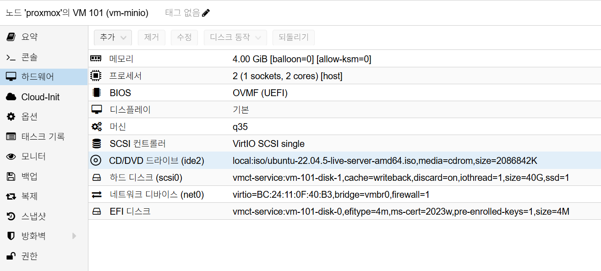

# MinIO Installation

## 개요

Ubuntu 22.04 VM에서 OS 설치를 완료한 뒤, Proxmox에서 `1TB` 데이터 디스크를 추가하고
`/data/minio` 경로를 사용해 MinIO를 설치하는 표준 절차입니다.

설치가 가장 중요한 기준 문서이므로, 구축 직후 필요한 검증, 초기 스냅샷, 운영 기준,
서비스 연동 준비, OIDC 준비, 자주 발생하는 장애 대응까지 이 문서에 포함합니다.

## 사전 조건

- OS: `Ubuntu 22.04 LTS`
- MinIO VM 준비 (OS만 설치된 상태)
- 내부 DNS 또는 고정 IP 확보
- 초기 H/W 구성
  - OS Disk: `40GB`
  - Data Disk: 없음
- MinIO 설치 전 확장 H/W 구성
  - Data Disk: `1TB` 추가

## 권장 아키텍처

- OS 디스크와 데이터 디스크를 분리합니다.
- MinIO 데이터 경로는 `/data/minio`를 기본으로 사용합니다.
- TLS 종료는 Reverse Proxy에서 수행하고 MinIO는 내부망으로 노출합니다.
- 주요 사용처는 Harbor, GitLab, Jenkins 연동입니다.

예시 구성:

- MinIO VM: `192.168.0.171`
- API endpoint: `http://192.168.0.171:9000`
- Console endpoint: `http://192.168.0.171:9001`
- SSO: Keycloak OIDC(`https://auth.semtl.synology.me/realms/semtl`)

## 네트워크 기준

- `net0` 단일 NIC 사용 (`192.168.0.x`)
- 예시 VM IP: `192.168.0.171`

### DNS / hostname 기준

MinIO VM을 DHCP로 운영하는 경우 `/etc/hosts`의 `127.0.1.1` 패턴을 유지해도 됩니다.

예시:

```text
127.0.0.1 localhost
127.0.1.1 minio.internal.semtl.synology.me vm-minio
```

검증 포인트:

- `hostname` -> `vm-minio`
- `hostname -f` -> `minio.internal.semtl.synology.me`
- `getent hosts minio.internal.semtl.synology.me` -> `127.0.1.1 ...`
- MinIO VM 자신에서 `nslookup minio.internal.semtl.synology.me` -> `127.0.0.1`
- 다른 PC에서 `nslookup minio.internal.semtl.synology.me` -> DHCP로 받은 실제 IP

중요:

- MinIO VM 자신에서 `nslookup` 결과가 `127.0.0.1`로 보이는 것은 의도한 동작입니다.
- 다른 PC에서 `nslookup` 결과가 `127.0.0.1` 또는 `127.0.1.1`이면 비정상입니다.
- OIDC, Reverse Proxy, 외부 endpoint 검증은 반드시 다른 PC 기준 DNS가 반환하는 실제 IP로 확인합니다.
- 상세 기준은 `../proxmox/dns-and-hostname-guide.md`를 따릅니다.

### Proxmox VM H/W 참고 이미지

아래 이미지는 Proxmox `Hardware` 탭 기준의 MinIO VM 구성 예시입니다.



캡션: OS 설치 후 Proxmox에서 `1TB` 데이터 디스크를 추가하고,
MinIO 데이터 경로를 `/data/minio`로 사용. 기본 VM은 `2 vCPU`, `4GB ~ 6GB RAM`,
`q35`, `OVMF (UEFI)`, OS Disk `40GB`, `vmbr0` 기준

## 설치 절차

## 1. OS 설치 후 1TB 디스크 추가

### 1.1 Proxmox에서 1TB 디스크 추가

- MinIO VM 정지
- `Hardware > Add > Hard Disk`에서 `1TB` 디스크 추가
- VM 기동 후 OS에서 새 디스크 인식 확인 (`/dev/sdb` 예시)

### 1.2 OS에서 데이터 디스크 마운트

```bash
lsblk -f
sudo apt update && sudo apt -y install xfsprogs
sudo mkfs.xfs -f /dev/sdb
sudo mkdir -p /data
sudo mount /dev/sdb /data
UUID=$(sudo blkid -s UUID -o value /dev/sdb)
[ -n "$UUID" ] || { echo "UUID 조회 실패: /dev/sdb 확인 필요"; exit 1; }
echo "UUID=$UUID /data xfs defaults,noatime 0 0" | sudo tee -a /etc/fstab
sudo mount -a
df -h /data
```

정상 기준:

- 데이터 디스크가 `/data`로 정상 마운트됨
- `mount -a` 이후에도 오류가 없어야 함
- `/data` 용량이 추가한 `1TB` 디스크 기준으로 표시되어야 함

## 2. MinIO 설치 (`/data/minio` 사용)

### 2.1 기본 점검

```bash
hostnamectl
timedatectl
sudo apt update && sudo apt -y upgrade
```

### 2.2 MinIO 바이너리 설치

```bash
MINIO_VERSION="RELEASE.2025-09-07T16-13-09Z"
MC_VERSION="RELEASE.2025-08-13T08-35-41Z"

sudo useradd --system --home /var/lib/minio --shell /sbin/nologin minio || true
sudo mkdir -p /usr/local/bin /etc/minio /var/lib/minio /data/minio
sudo chown -R minio:minio /var/lib/minio /data/minio

curl -fsSL -o minio \
  "https://dl.min.io/server/minio/release/linux-amd64/archive/minio.${MINIO_VERSION}"
chmod +x minio
sudo mv minio /usr/local/bin/minio

curl -fsSL -o mc \
  "https://dl.min.io/client/mc/release/linux-amd64/archive/mc.${MC_VERSION}"
chmod +x mc
sudo mv mc /usr/local/bin/mc

/usr/local/bin/minio --version
/usr/local/bin/mc --version
```

### 2.3 환경 변수 설정

`/etc/default/minio`:

```bash
sudo tee /etc/default/minio >/dev/null <<'ENV'
MINIO_ROOT_USER=admin
MINIO_ROOT_PASSWORD=<change-required>
MINIO_VOLUMES="/data/minio"
MINIO_OPTS="--address :9000 --console-address :9001"
ENV
```

설정 기준:

- `MINIO_ROOT_PASSWORD`는 실제 운영 비밀번호로 교체합니다.
- MinIO 비밀번호는 최소 `8자` 이상 사용합니다. `6자` 비밀번호는 사용할 수 없습니다.
- 문서에는 실제 비밀번호를 남기지 않습니다.
- `MINIO_VOLUMES`는 `/data/minio`를 유지합니다.
- `mc`는 반드시 S3 API endpoint(`9000`)를 사용하고 Console(`9001`)을 사용하지 않습니다.

### 2.4 systemd 서비스 등록

```bash
sudo tee /etc/systemd/system/minio.service >/dev/null <<'SERVICE'
[Unit]
Description=MinIO
Wants=network-online.target
After=network-online.target

[Service]
User=minio
Group=minio
EnvironmentFile=/etc/default/minio
ExecStart=/usr/local/bin/minio server $MINIO_VOLUMES $MINIO_OPTS
Restart=always
LimitNOFILE=65536

[Install]
WantedBy=multi-user.target
SERVICE

sudo systemctl daemon-reload
sudo systemctl enable --now minio
sudo systemctl status minio --no-pager
```

### 2.5 초기 접속 확인

```bash
# MinIO health endpoint 응답 확인
curl -I http://127.0.0.1:9000/minio/health/live
# mc가 사용할 MinIO 접속 별칭(local) 등록
mc alias set local http://127.0.0.1:9000 admin '<change-required>'
# 관리 API 기준으로 MinIO 상태 확인
mc admin info local
```

## 설치 검증

- `1TB` 디스크가 `/data`로 정상 마운트됨
- `minio.service`가 `active (running)` 상태
- `curl -I http://127.0.0.1:9000/minio/health/live` 응답 정상
- `mc admin info local` 응답 정상
- MinIO 데이터 경로가 `/data/minio`로 설정됨
- `minio --version`, `mc --version`이 의도한 고정 버전과 일치함

## 설치 직후 운영 기준

- endpoint는 `http://192.168.0.171:9000` 기준으로 사용합니다.
- console은 `http://192.168.0.171:9001` 기준으로 사용합니다.
- data path는 `/data/minio`로 유지합니다.
- Object Storage 주요 사용처는 Harbor, GitLab, Jenkins입니다.
- 서비스별 전용 계정을 분리해 최소 권한으로 운영합니다.

## 서비스 계정 정책

권장 서비스 계정은 아래 기준으로 분리합니다.

| 계정 | 용도 | 권한 범위 |
| --- | --- | --- |
| `svc-harbor-s3` | Harbor storage | `harbor/*` |
| `svc-gitlab-s3` | GitLab storage | `gitlab-*` |
| `svc-ci-artifact` | CI 업로드 | `ci/*` |
| `svc-backup` | 백업 | `backup/*` |

운영 기준:

- 서비스별 계정과 secret은 서로 공유하지 않습니다.
- 계정명은 사람 계정과 구분되도록 `svc-` 접두사를 유지합니다.
- root 계정과 서비스 계정 비밀번호는 모두 최소 `8자` 이상으로 설정합니다.
- 가능하면 서비스별 전용 bucket 또는 prefix로 권한 범위를 제한합니다.
- root 계정은 초기 구축과 정책 생성에만 사용하고, 일상 운영에는 사용하지 않습니다.

## 서비스 연동 문서

MinIO 설치를 마친 뒤 아래 순서로 연동을 진행합니다.

1. [MinIO Harbor 연동](./harbor-integration.md)
1. [MinIO GitLab 연동](./gitlab-integration.md)
1. [MinIO Jenkins 연동](./jenkins-integration.md)

## 초기 스냅샷

스냅샷은 반드시 불필요 파일 정리 후 생성합니다.

### 1. 불필요 파일 정리

```bash
# 스냅샷 전 임시 파일 정리
sudo rm -rf /tmp/*
# 스냅샷 전 시스템 임시 파일 정리
sudo rm -rf /var/tmp/*
# 불필요 패키지 제거
sudo apt autoremove -y
# 패키지 캐시 정리
sudo apt clean
# 과거 journal 로그 최소화
sudo journalctl --vacuum-time=1s
# 셸 히스토리 정리
cat /dev/null > ~/.bash_history && history -c
```

### 2. Proxmox 스냅샷 생성

- Proxmox에서 MinIO VM 선택
- `Snapshots > Take Snapshot` 실행
- 이름 예시: `minio-install-clean-v1`
- 설명 예시:

  ```text
  [설치]
  - 1TB disk(xfs) : /data 마운트
  - minio 서비스 계정 생성
  - MINIO_VOLUMES="/data/minio"
  - minio : RELEASE.2025-09-07T16-13-09Z
  - mc : RELEASE.2025-08-13T08-35-41Z
  - id : admin
  - pw : <change-required>
  ```

- `Include RAM`은 비활성화 권장

## 운영 작업 예시

### 일일 점검

```bash
# MinIO 서비스 활성 상태 확인
sudo systemctl is-active minio
# MinIO health endpoint 간단 점검
curl -sS http://127.0.0.1:9000/minio/health/live
# 관리 API 기준으로 MinIO 상태 확인
mc admin info local
```

확인 항목:

- 서비스 상태 정상
- Health endpoint 응답 정상
- 디스크 사용률 임계치 이하

### 버킷 / 계정 운영 예시

```bash
# mc가 사용할 MinIO 접속 별칭(local) 등록
mc alias set local http://127.0.0.1:9000 <MINIO_ROOT_USER> '<MINIO_ROOT_PASSWORD>'
# Harbor용 bucket 생성
mc mb local/harbor
# Harbor 서비스 계정 생성
mc admin user add local svc-harbor-s3 'replace-with-strong-password'
```

### Harbor 연동 계정 비밀번호 변경 절차

1. MinIO에서 사용자 비밀번호를 갱신합니다.
1. 기존 비밀번호 평문 조회는 불가하므로, 모르면 재설정 기준으로 처리합니다.

```bash
# Harbor 서비스 계정 비밀번호 갱신
mc admin user add local svc-harbor-s3 'replace-with-strong-password'
```

1. Harbor VM의 `harbor.yml`에서 `storage_service.s3.secretkey`를 동일 값으로 변경합니다.
1. Harbor를 재적용합니다.

```bash
# Harbor 설정 디렉터리로 이동
cd ~/harbor
# harbor.yml 기준으로 컨테이너 설정 재생성
sudo ./prepare
# 변경된 설정으로 Harbor 재기동
docker compose up -d
```

1. 이미지 push/pull로 연동을 검증합니다.

### 용량 관리 기준

- `/data` 사용률 `70%` 초과 시 정리 계획 수립
- `/data` 사용률 `85%` 초과 시 즉시 확장 또는 정리 실행
- 정기적으로 미사용 아티팩트/오브젝트 정리

## OIDC 연동 준비

### 대상 환경

- Keycloak: `https://auth.semtl.synology.me`
- Realm: `semtl`
- MinIO S3 API endpoint: `http://192.168.0.171:9000`
- MinIO Console: `http://192.168.0.171:9001`

### Keycloak Client 구성

1. `Realm -> semtl` 선택
1. `Clients -> Create client`
1. Client ID: `minio`
1. OIDC client로 생성
1. Redirect URI에 MinIO callback URI 등록

주의:

- Callback URI는 운영 MinIO 또는 Proxy 구성에 맞춰 정확히 등록합니다.
- 잘못된 Redirect URI는 로그인 루프 또는 실패의 주요 원인입니다.

### 정책 Claim 전략

- Keycloak 사용자 attribute `policy`를 토큰 claim으로 전달합니다.
- MinIO에 동일 이름 정책을 생성해 매핑합니다.

예시:

- Keycloak user attribute: `policy=readwrite`
- MinIO policy name: `readwrite`

### Keycloak 21+ User Profile 주의사항

최신 Keycloak에서는 사용자 attribute를 임의 입력하지 못할 수 있습니다.
이 경우 먼저 `User profile`에 attribute를 정의해야 합니다.

절차:

1. `Realm settings -> User profile`
2. `Create attribute`
3. 다음 값으로 생성
   - Name: `policy`
   - Display name: `policy`
   - Multivalued: `OFF`
   - Required: `OFF`
   - Who can edit: `Admin`
   - Who can view: `Admin`
4. 저장 후 `Users -> <user> -> Details`에서 `policy=readwrite` 입력

### MinIO OIDC 설정 적용

```bash
# mc가 사용할 MinIO 접속 별칭(myminio) 등록
mc alias set myminio http://127.0.0.1:9000 <MINIO_ROOT_USER> '<MINIO_ROOT_PASSWORD>'
DISCOVERY_URL="https://auth.semtl.synology.me/realms/semtl/.well-known/openid-configuration"

# MinIO OIDC 설정 반영
mc admin config set myminio identity_openid \
  config_url="$DISCOVERY_URL" \
  client_id="minio" \
  client_secret="<keycloak-client-secret>" \
  claim_name="policy" \
  scopes="openid,profile,email"

# 설정 적용을 위해 MinIO 서비스 재시작
mc admin service restart myminio
# 현재 OIDC 설정값 확인
mc admin config get myminio identity_openid
```

### OIDC 정합성 검증

1. MinIO Console에서 OIDC 로그인 시도
1. 로그인 사용자 권한이 `policy` 값과 일치하는지 확인
1. `mc admin info myminio`로 관리 연결 상태 점검
1. Keycloak Client 설정과 MinIO callback URL이 정확히 일치하는지 확인

## 자주 발생하는 이슈

### 1. `mc admin user add` 실행 시 Signature 오류

증상:

- `The request signature we calculated does not match the signature you provided`

주요 원인:

- `mc alias`가 MinIO root 계정이 아닌 다른 계정으로 설정됨
- root 비밀번호 변경 후 기존 alias 인증 정보가 오래된 상태

조치:

1. root 계정 정보를 확인합니다.

```bash
# MinIO 환경 파일에 root 계정 정보가 남아 있는지 확인
sudo egrep 'MINIO_ROOT_USER|MINIO_ROOT_PASSWORD' /etc/default/minio
```

1. alias를 재설정합니다.

```bash
# mc가 사용할 MinIO 접속 별칭(local) 등록
mc alias set local http://127.0.0.1:9000 <MINIO_ROOT_USER> '<MINIO_ROOT_PASSWORD>'
# 관리 API 응답 확인
mc admin info local
```

1. 다시 사용자 비밀번호를 갱신합니다.

```bash
# Harbor 서비스 계정 비밀번호 갱신
mc admin user add local svc-harbor-s3 'replace-with-strong-password'
```

### 2. 단일 루트 디스크에 MinIO 데이터가 함께 저장됨

증상:

- OS와 MinIO 데이터가 같은 볼륨(`/`)에 누적됨

위험:

- Object 증가 시 루트 디스크 Full로 시스템 장애를 유발할 수 있음

조치:

- 데이터 디스크를 추가하고 `/data/minio`로 분리합니다.
- `fstab` 영구 마운트 설정 후 MinIO 데이터 경로를 고정합니다.

### 3. Harbor 연동 후 Push / Pull 실패

점검 순서:

1. MinIO 계정(`accesskey`, `secretkey`)과 Harbor 설정 일치 여부 확인
2. `regionendpoint`, `secure`, `s3forcepathstyle` 값 확인
3. Harbor 재적용(`./prepare`, `docker compose up -d`) 후 재시도

### 4. 서비스 기동 실패

점검:

```bash
sudo systemctl status minio --no-pager
sudo journalctl -u minio -n 200 --no-pager
```

주요 원인:

- `/etc/default/minio` 오타
- 데이터 경로 권한 불일치
- 포트 충돌(`9000`, `9001`)

### 5. `No valid configuration found for 'myminio' host alias`

증상:

- `mc admin policy list myminio` 실행 시 alias 관련 오류 발생

주요 원인:

- `myminio` alias 미등록
- alias가 MinIO Console(`9001`)로 등록됨

조치:

```bash
mc alias set myminio http://127.0.0.1:9000 <MINIO_ROOT_USER> '<MINIO_ROOT_PASSWORD>'
mc alias ls
mc admin info myminio
```

### 6. OIDC 로그인 후 정책 권한이 적용되지 않음

증상:

- Keycloak 로그인은 성공하지만 MinIO 권한이 기대와 다름
- 토큰에 `policy` claim이 없음

주요 원인:

- Keycloak User Profile 스키마에 `policy` attribute 정의가 없음
- 사용자 `policy` 값 미입력 또는 mapper 미구성

조치:

1. Keycloak `Realm settings -> User profile`에서 `policy` attribute 생성
2. `Who can view/edit`에 최소 `Admin` 권한 부여
3. 사용자 `Details`에서 `policy=readwrite` 입력
4. Client mapper가 `policy`를 토큰 claim으로 내보내는지 확인

## 보안 주의사항

- root 계정, 사용자 비밀번호, Keycloak client secret은 문서에 직접 남기지 않습니다.
- MinIO root 계정과 서비스 계정 비밀번호는 최소 `8자` 이상 사용합니다.
- 예시 비밀번호는 모두 placeholder로 유지합니다.
- 운영 전 실제 비밀번호와 secret은 별도 비밀 관리 수단으로 분리합니다.
