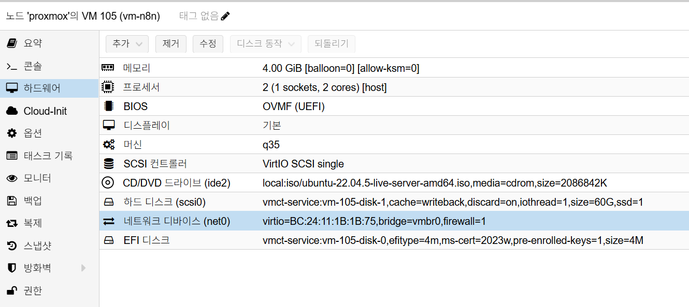

# n8n Installation

## 개요

이 문서는 Synology Reverse Proxy(TLS 종료) 뒤에서 VM 1대 기준으로
`Docker Compose`를 사용해 `n8n`과 `PostgreSQL`을 설치하고,
초기 검증까지 수행하는 절차를 설명합니다.

이 문서의 기본 구성은 다음을 전제로 합니다.

- n8n은 `PostgreSQL`을 메인 DB로 사용합니다.
- TLS 종료는 Synology Reverse Proxy에서 수행합니다.
- n8n VM은 `5678/tcp`를 내부망에만 노출합니다.
- 운영 기본값으로 telemetry는 비활성화합니다.

## 사전 조건

- OS: Ubuntu 22.04 LTS 이상
- VM 리소스: `2 vCPU / 4GB RAM` 이상
- 디스크: OS `60GB` 이상
- n8n 버전: `v2.14.2`
- 도메인: `n8n.semtl.synology.me`
- Reverse Proxy 라우팅 준비:
  `https://n8n.semtl.synology.me` -> `http://<N8N_VM_IP>:5678`
- VM 방화벽에서 `5678/tcp`(내부 경로) 허용
- 필수 패키지: `docker`, `docker compose plugin`, `openssl`

### Proxmox VM H/W 참고 이미지

아래 이미지는 Proxmox `Hardware` 탭 기준의 n8n VM 구성 예시입니다.



캡션: `2 vCPU`, `2GB ~ 4GB RAM`, `q35`, `OVMF (UEFI)`, OS Disk `60GB`, `vmbr0`

## 네트워크 기준

- `net0` 단일 NIC 사용 (`192.168.0.x`)
- 예시 VM IP: `192.168.0.175`

## 배치 원칙

- `n8n` 애플리케이션과 `PostgreSQL`을 동일 VM의 Compose 스택으로 구성
- 설치/운영 파일 경로는 사용자 홈(`~/n8n`) 기준으로 관리
- 백업 단순화를 위해 named volume 대신 bind mount(호스트 폴더) 사용
- 외부 노출은 Reverse Proxy(TLS) 경유를 기본 원칙으로 사용
- 워크플로/자격증명 암호화를 위해 `N8N_ENCRYPTION_KEY`를 고정 관리

## 설치 절차

### 1. Docker/Compose/OpenSSL 설치 및 확인

Ubuntu 22.04.5 Server 기준으로, 아래 명령으로 Docker Engine,
Docker Compose Plugin, OpenSSL을 먼저 설치합니다.

```bash
# 패키지 인덱스 갱신 및 필수 유틸 설치
sudo apt update
sudo apt install -y ca-certificates curl gnupg openssl

# Docker 공식 APT 저장소 GPG 키 등록
sudo install -m 0755 -d /etc/apt/keyrings
curl -fsSL https://download.docker.com/linux/ubuntu/gpg \
  | sudo gpg --dearmor -o /etc/apt/keyrings/docker.gpg
sudo chmod a+r /etc/apt/keyrings/docker.gpg

# Docker 공식 저장소 등록(Ubuntu codename 자동 감지)
ARCH="$(dpkg --print-architecture)"
CODENAME="$(. /etc/os-release && echo \"$VERSION_CODENAME\")"
echo "deb [arch=$ARCH signed-by=/etc/apt/keyrings/docker.gpg] \
https://download.docker.com/linux/ubuntu $CODENAME stable" \
  | sudo tee /etc/apt/sources.list.d/docker.list >/dev/null

# Docker/Compose 설치
sudo apt update
sudo apt install -y docker-ce docker-ce-cli containerd.io docker-compose-plugin

# 현재 사용자를 docker 그룹에 추가
sudo usermod -aG docker $USER
newgrp docker
```

설치 확인:

```bash
docker --version
docker compose version
openssl version
```

### 2. 작업 디렉터리 생성

```bash
mkdir -p ~/n8n/{postgres-data,n8n-data,n8n-files}
cd ~/n8n
```

### 3. 환경 변수 파일 작성

```bash
# n8n 암호화 키 생성(최초 1회 생성 후 운영 중 변경 금지)
N8N_ENCRYPTION_KEY="$(openssl rand -hex 32)"

cat > ~/n8n/.env <<EOF
# n8n 버전
N8N_VERSION=2.14.2

# 외부 접근 도메인/URL
N8N_HOST=n8n.semtl.synology.me
N8N_EDITOR_BASE_URL=https://n8n.semtl.synology.me
WEBHOOK_URL=https://n8n.semtl.synology.me/
N8N_PROXY_HOPS=1

# 보안/실행 옵션
N8N_ENCRYPTION_KEY=${N8N_ENCRYPTION_KEY}
N8N_ENFORCE_SETTINGS_FILE_PERMISSIONS=true
N8N_DIAGNOSTICS_ENABLED=false
NODE_ENV=production

# 시간대
GENERIC_TIMEZONE=Asia/Seoul
TZ=Asia/Seoul

# PostgreSQL 연결 정보
POSTGRES_DB=n8n
POSTGRES_USER=n8n
POSTGRES_PASSWORD=<change-required>
EOF

# .env 접근 권한 제한
chmod 600 ~/n8n/.env
```

이 문서의 예시는 `N8N_VERSION=2.14.2` 기준으로 작성했습니다.

현재 문서의 Compose 파일 기준으로, 위 `.env` 변수들을 모두 정의하면
기동에 필요한 환경변수는 충족됩니다.

설치 시점에 아래 값은 반드시 원하는 값으로 교체합니다.

- `POSTGRES_PASSWORD`
- `N8N_ENCRYPTION_KEY` (자동 생성값 유지)
- `N8N_HOST`
- `N8N_EDITOR_BASE_URL`
- `WEBHOOK_URL`

참고:

- n8n `Owner` 계정(이메일 기반)은 첫 로그인 후 UI에서 생성합니다.
- n8n `v1.0+`부터 인스턴스 Basic Auth 환경변수는 지원되지 않습니다.
- `N8N_ENCRYPTION_KEY`는 위 명령으로 자동 생성되며 백업 시 반드시 포함합니다.
- 운영 기본값으로 `N8N_DIAGNOSTICS_ENABLED=false`를 사용합니다.
- `N8N_RUNNERS_ENABLED`는 더 이상 필요하지 않으므로 추가하지 않습니다.

### 4. Compose 파일 작성

```bash
cat > ~/n8n/docker-compose.yml <<'EOF'
services:
  postgres:
    image: postgres:16
    container_name: n8n-postgres
    restart: unless-stopped
    environment:
      - POSTGRES_DB=${POSTGRES_DB}
      - POSTGRES_USER=${POSTGRES_USER}
      - POSTGRES_PASSWORD=${POSTGRES_PASSWORD}
    volumes:
      # PostgreSQL 데이터 디렉터리(호스트 폴더 백업 대상)
      - ./postgres-data:/var/lib/postgresql/data
    healthcheck:
      test: ['CMD-SHELL', 'pg_isready -U ${POSTGRES_USER} -d ${POSTGRES_DB}']
      interval: 5s
      timeout: 5s
      retries: 10

  n8n:
    image: docker.n8n.io/n8nio/n8n:${N8N_VERSION}
    container_name: n8n
    restart: unless-stopped
    depends_on:
      postgres:
        condition: service_healthy
    ports:
      - "5678:5678"
    environment:
      - NODE_ENV=${NODE_ENV}
      - N8N_ENFORCE_SETTINGS_FILE_PERMISSIONS=${N8N_ENFORCE_SETTINGS_FILE_PERMISSIONS}
      - N8N_DIAGNOSTICS_ENABLED=${N8N_DIAGNOSTICS_ENABLED}
      - N8N_HOST=${N8N_HOST}
      - N8N_PROTOCOL=https
      - N8N_PORT=5678
      - N8N_EDITOR_BASE_URL=${N8N_EDITOR_BASE_URL}
      - WEBHOOK_URL=${WEBHOOK_URL}
      - N8N_PROXY_HOPS=${N8N_PROXY_HOPS}
      - N8N_ENCRYPTION_KEY=${N8N_ENCRYPTION_KEY}
      - GENERIC_TIMEZONE=${GENERIC_TIMEZONE}
      - TZ=${TZ}
      - DB_TYPE=postgresdb
      - DB_POSTGRESDB_HOST=postgres
      - DB_POSTGRESDB_PORT=5432
      - DB_POSTGRESDB_DATABASE=${POSTGRES_DB}
      - DB_POSTGRESDB_USER=${POSTGRES_USER}
      - DB_POSTGRESDB_PASSWORD=${POSTGRES_PASSWORD}
      - DB_POSTGRESDB_SCHEMA=public
    volumes:
      # n8n 데이터(워크플로, 크리덴셜 등) 저장 경로
      - ./n8n-data:/home/node/.n8n
      # n8n 내부에서 접근할 사용자 파일 경로
      - ./n8n-files:/files
EOF
```

구성 기준:

- 이 기본 설치 문서는 task runner 관련 별도 환경변수를 사용하지 않습니다.
- `N8N_RUNNERS_ENABLED`는 제거된 설정이므로 넣지 않습니다.
- telemetry 오류를 줄이기 위해 `N8N_DIAGNOSTICS_ENABLED=false`를 기본값으로 둡니다.
- Python Code node 운영이 필요하면 기본 설치 후 external mode runner를 별도 설계합니다.

### 5. 컨테이너 기동

```bash
cd ~/n8n
docker compose pull
docker compose up -d
docker compose ps
docker compose logs --tail=100 n8n
```

### 6. Synology Reverse Proxy 연결

DSM `Control Panel > Login Portal > Advanced > Reverse Proxy`에서 아래와 같이
규칙을 생성합니다.

- Source
  - Protocol: `HTTPS`
  - Hostname: `n8n.semtl.synology.me`
  - Port: `443`
- Destination
  - Protocol: `HTTP`
  - Hostname: `<N8N_VM_IP>`
  - Port: `5678`

Custom Header에 아래 항목을 추가합니다.

- `X-Forwarded-Proto: https`
- `X-Forwarded-Port: 443`
- `X-Forwarded-Host: n8n.semtl.synology.me`

## 설치 검증

```bash
# 컨테이너 상태 확인
docker compose -f ~/n8n/docker-compose.yml ps

# n8n 헬스체크 확인
curl -fsS http://127.0.0.1:5678/healthz

# 도메인 경유 응답 확인
curl -I https://n8n.semtl.synology.me

# 로그 확인(최근 100줄)
docker compose -f ~/n8n/docker-compose.yml logs --tail=100 n8n
```

검증 기준:

- `n8n`, `n8n-postgres` 컨테이너가 `Up` 상태
- `/healthz` 요청이 정상 응답
- UI 로그인 페이지 접근 가능(`https://n8n.semtl.synology.me`)
- 로그에 `N8N_RUNNERS_ENABLED` deprecation 경고가 없어야 함
- telemetry를 끈 구성이라면 `telemetry.n8n.io ENOTFOUND` 경고도 없어야 함

## 운영 메모

- 버전 업데이트:
  `.env`의 `N8N_VERSION` 변경 후 `docker compose pull && docker compose up -d`
- 백업 대상:
  `~/n8n/postgres-data`, `~/n8n/n8n-data`, `~/n8n/.env`, `~/n8n/n8n-files`
- 민감 정보 관리:
  `.env`의 인증 정보/암호는 비밀관리 시스템으로 이관 권장

## 7. 설치 직후 정리 후 스냅샷

스냅샷은 반드시 불필요 파일(찌꺼기) 정리 후 생성합니다.

### 7.1 불필요 파일 정리

```bash
# /tmp 전체 삭제
sudo rm -rf /tmp/*

# /var/tmp 전체 삭제
sudo rm -rf /var/tmp/*

# 미사용 패키지 정리
sudo apt autoremove -y

# APT 캐시 정리
sudo apt clean

# journal 로그 전체 정리
sudo journalctl --vacuum-time=1s

# 현재 사용자 bash 히스토리 비우기
cat /dev/null > ~/.bash_history && history -c
```

### 7.2 Proxmox 스냅샷 생성

- n8n `Owner` 계정 생성, 라이선스 등록 완료 후 운영 워크플로/크리덴셜 등록 전 생성
- Proxmox에서 n8n VM 선택
- `Snapshots > Take Snapshot` 실행
- 이름 예시: `n8n-install-clean-v1`
- 설명 예시:

  ```text
  [설치]
  - n8n : v2.14.2
  - hostname : n8n.semtl.synology.me
  - reverse proxy : synology(443) -> n8n vm(5678)
  - data path : ~/n8n/n8n-data
  - files path : ~/n8n/n8n-files
  - postgres path : ~/n8n/postgres-data
  - id : admin@semtl.synology.me
  - pw : <change-required>
  ```

- `Include RAM`은 비활성화(권장)

## 트러블슈팅

### 증상: 로그인 후 자격증명 복호화 오류

- 원인: `N8N_ENCRYPTION_KEY` 변경 또는 누락
- 조치: 최초 운영 시점의 `N8N_ENCRYPTION_KEY`를 복구하고 재기동

### 증상: `N8N_RUNNERS_ENABLED` deprecation 경고가 보임

- 원인: 과거 설정 예시가 `.env` 또는 `docker-compose.yml`에 남아 있음
- 조치: `N8N_RUNNERS_ENABLED`를 제거하고
  `docker compose down && docker compose up -d`로 재기동

### 증상: `telemetry.n8n.io` DNS 오류가 보임

- 원인: telemetry 활성 상태에서 외부 DNS 해석이 실패함
- 조치: 운영 기본값대로 `N8N_DIAGNOSTICS_ENABLED=false`를 적용하거나,
  외부 DNS 경로를 점검

### 증상: 웹훅 URL이 내부 IP로 생성됨

- 원인: `N8N_HOST`, `N8N_PROTOCOL`, `WEBHOOK_URL` 불일치 또는
  Reverse Proxy `X-Forwarded-*` 헤더 누락
- 조치: `.env`와 Compose 환경 변수를 도메인 기준으로 맞추고,
  Synology Reverse Proxy Custom Header를 재확인한 뒤 재기동

## 참고

- [n8n 공식 문서](https://docs.n8n.io/)
- [n8n Hosting Docs](https://docs.n8n.io/hosting/)
- [Docker Compose 문서](https://docs.docker.com/compose/)
