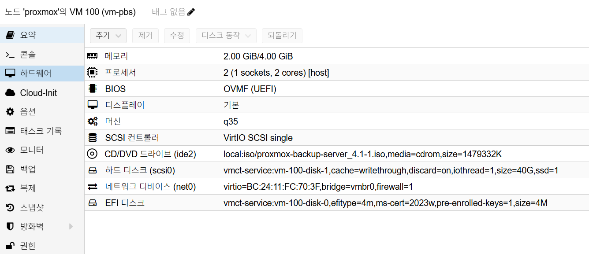

# Proxmox Backup Server Installation

## 개요

이 문서는 Proxmox VE 환경에서 Proxmox Backup Server(PBS)를 별도 VM으로
설치하고, 초기 접속 및 기본 관리 설정까지 수행하는 절차를 정리합니다.

## 아키텍처와 버전 기준

- 권장 구조: `Proxmox VM(PBS)`
- 권장 배치: `PBS`는 `Kubernetes` 밖(독립 VM)에서 운영
- 버전 기준: `Proxmox VE 9.x` 환경은 `PBS 4.x` 사용

## 네이밍 및 DNS 기준

- 내부 전용 이름보다 실제 관리 중인 도메인 우선
- 이 환경에서는 `*.internal.semtl.synology.me` 체계를 사용
- PBS short hostname 권장: `vm-pbs`
- PBS 권장 FQDN: `pbs.internal.semtl.synology.me`
- PBS 관리 IP 예시: `192.168.0.253`
- Synology DNS Server IP 예시: `192.168.0.2`
- Gateway 예시: `192.168.0.1`

참고:

- 설치 자체는 짧은 이름(`vm-pbs`)만으로도 진행될 수 있습니다.
- 다만 내부 DNS, 인증서, 메일 알림, 자기 자신에 대한 이름 해석까지
  고려하면 PBS에는 FQDN을 맞추는 편이 안정적입니다.
- 운영 정합성은 `hostname`은 short hostname, `hostname -f`는 FQDN이
  되도록 맞추는 구성을 우선 권장합니다.
- `.local`은 mDNS 충돌 여지가 있으므로 기본 선택지로 두지 않습니다.

## 사전 조건

- Proxmox VE에서 PBS용 VM 생성 권한
- PBS ISO 이미지 다운로드 (`https://www.proxmox.com/en/downloads`)
- Synology 측 DNS 사전 준비
  ([시놀로지 설치 가이드](../synology/installation.md) 참고)
- PBS 고정 IP 및 FQDN 계획

예시 PBS IP:
`192.168.0.253`

예시 FQDN:
`pbs.internal.semtl.synology.me`

사전 준비 상세:
[시놀로지 설치 가이드](../synology/installation.md)

## 1) PBS VM 생성 (Proxmox)

Proxmox Web UI에서 `Create VM`을 실행합니다.

### Proxmox VM H/W 참고 이미지

아래 이미지는 Proxmox `Hardware` 탭 기준의 PBS VM 구성 예시입니다.



캡션: `2 vCPU`, `2GB ~ 4GB RAM`, `q35`, `OVMF (UEFI)`, OS Disk `40GB`, `vmbr0`

### General

- `VM ID`: 예) `100`
- `Name`: 예) `vm-pbs`

### OS

- `ISO Image`: `proxmox-backup-server_4.x-x.iso`
- `Guest OS`: `Linux`

### System

- `Machine`: `q35`
- `BIOS`: `OVMF (UEFI)` 또는 기본값
- `SCSI Controller`: `VirtIO SCSI single`

### Disk (OS 디스크)

- `Bus/Device`: `SCSI`
- `Disk size`: `40GB`
- `Cache`: `writethrough`
- `Discard`: `on`
- `SSD emulation`: `on`
- `IO thread`: `on`

### CPU / Memory

- 기본 권장: `2 vCPU`, `2GB RAM`
- 리소스 여유 시: `4 vCPU`, `8GB RAM`까지 확장

### Network

- `Bridge`: `vmbr0`
- `Model`: `VirtIO`

## 2) PBS ISO 설치

VM 콘솔에서 부팅 후 설치를 진행합니다.

1. 부트 메뉴에서 `Install Proxmox Backup Server (Graphical)` 선택
1. 디스크 선택 화면에서 PBS OS 디스크(`/dev/sda`) 선택
1. `Location / Timezone / Keyboard` 설정
1. `root` 비밀번호 및 `email` 설정
1. 네트워크 설정
1. 설치 완료 후 재부팅

권장 Locale:
`Asia/Seoul`, `U.S. English`

예시 네트워크 설정:

- `Management Interface`: `nic0 - bc:24:11:fc:70:3f (virtio_net)`
- `Hostname`: `pbs.internal.semtl.synology.me`
- `IP`: `192.168.0.253`
- `CIDR`: `24`
- `Gateway`: `192.168.0.1`
- `DNS`: `192.168.0.2`

입력 원칙:

- `Hostname`은 설치 단계부터 FQDN으로 맞추는 것을 권장
- 설치 화면상 NIC 이름은 `nic0`처럼 보일 수 있으며, OS 내부 이름은 설치 후
  `ens18` 등으로 다르게 표시될 수 있음
- `DNS`는 공유기보다 Synology DNS를 직접 지정
- 짧은 이름을 별칭으로 계속 쓰고 싶다면 설치 후 `/etc/hosts`에서
  `vm-pbs` 같은 alias를 추가

## 3) Web UI에서 APT 리포지토리 설정

초기 설치 직후에는 PBS Web UI에서 Enterprise 리포지토리 상태를 먼저 확인하고,
구독이 없는 환경이면 `pbs-no-subscription` 리포지토리를 사용하도록 맞춥니다.

Web UI 경로:

1. `관리`
1. `리포지토리`
1. `pbs-enterprise` 항목 선택
1. `비활성화`
1. `추가` -> `No-Subscription` 선택

확인 기준:

- `pbs-enterprise`가 비활성화 상태
- `http://download.proxmox.com/debian/pbs` 저장소가 활성화 상태
- 컴포넌트가 `pbs-no-subscription`으로 표시됨

CLI로 함께 확인하려면 아래 파일을 점검합니다.

```bash
cat /etc/apt/sources.list.d/pbs-enterprise.sources
cat /etc/apt/sources.list.d/proxmox.sources
```

운영 메모:

- 구독이 없는 홈랩/테스트 환경에서는 `pbs-no-subscription` 구성이 일반적입니다.
- 운영 환경에서 Enterprise 구독을 사용 중이면 이 단계를 건너뛰고
  `pbs-enterprise`를 유지합니다.

## 4) 설치 후 초기 업데이트

PBS에 SSH 접속 후 업데이트를 수행합니다.

```bash
apt update
apt dist-upgrade -y
```

## 5) `qemu-guest-agent` 설치 및 활성화

Proxmox VM에서 IP 조회, shutdown 연동, 상태 확인을 안정적으로 사용하려면
게스트 OS 안에 `qemu-guest-agent`를 설치합니다.

```bash
apt install -y qemu-guest-agent
systemctl enable --now qemu-guest-agent
systemctl status qemu-guest-agent
```

Proxmox Web UI에서도 VM 옵션을 함께 확인합니다.

1. PBS VM 선택
1. `옵션`
1. `QEMU Guest Agent` 항목 확인
1. 필요 시 `활성화(Enabled)`로 변경

확인 기준:

- VM 내부에서 `qemu-guest-agent` 서비스가 `active (running)`
- Proxmox Web UI에서 `QEMU Guest Agent`가 활성화 상태

## 6) 운영자 계정 및 sudo 초기 설정

기본 `root` 계정만 계속 사용하는 대신 운영자 계정을 추가하고 `sudo` 권한을
부여하는 구성을 권장합니다.

### 6-1. sudo 설치

PBS 최소 설치 환경에서는 `sudo`가 기본 설치되어 있지 않을 수 있으므로 먼저
패키지를 확인하고 설치합니다.

```bash
apt update
apt install -y sudo
```

### 6-2. `semtl` 계정 생성 및 sudo 권한 부여

```bash
adduser semtl
usermod -aG sudo semtl
id semtl
groups semtl
```

확인 기준:

- `semtl` 계정이 생성됨
- `sudo` 그룹에 `semtl`이 포함됨

필요 시 실제 전환 테스트:

```bash
su - semtl
sudo whoami
```

정상 결과는 `root`입니다.

### 6-3. root 비밀번호 변경

초기 설치 시 설정한 `root` 비밀번호를 재설정하려면 아래 명령을 사용합니다.

```bash
passwd root
```

운영 권장:

- `root`와 일반 운영자 계정의 비밀번호를 동일하게 사용하지 않음
- 가능하면 `semtl` 계정으로 `sudo`를 사용하고 `root` 직접 로그인은 최소화
- 비밀번호 변경 후 SSH 세션과 Web UI 로그인 모두 재확인

### 6-4. SSH를 `semtl` 전용으로 제한

`root` 비밀번호 변경이 끝나면 SSH는 `semtl` 계정만 허용하도록 제한합니다.

이 저장소 기준 PBS SSH 운영 원칙은 아래와 같습니다.

- SSH 접속은 `semtl` 계정으로만 허용
- `root`는 SSH 직접 접속 금지
- 필요 작업은 `semtl` 로그인 후 `sudo`로 수행

실행 권한:

- 아래 명령은 `root` 쉘에서 실행하거나 `semtl` 계정으로 로그인한 뒤 `sudo`를 붙여 실행합니다.

설정 파일 생성:

```bash
install -d -m 0755 /etc/ssh/sshd_config.d
cat <<'EOF' > /etc/ssh/sshd_config.d/90-semtl-access.conf
PermitRootLogin no
PasswordAuthentication yes
PubkeyAuthentication yes
AllowUsers semtl
EOF
```

파일명 규칙 메모:

- `sshd_config.d` 아래 `*.conf` 파일은 보통 이름순으로 읽습니다.
- 그래서 `00-`, `10-`, `50-`, `90-`처럼 앞에 숫자를 붙여 적용 순서를 관리합니다.
- `90-semtl-access.conf`는 기본 설정 뒤에서 운영 정책을 덮어쓰는 용도로 사용합니다.

설정 검증 및 적용:

```bash
sshd -t
systemctl restart ssh
systemctl status ssh --no-pager
```

접속 검증:

```bash
ssh semtl@192.168.0.253
ssh root@192.168.0.253
```

기대 결과:

- `ssh semtl@192.168.0.253` 접속 성공
- `ssh root@192.168.0.253` 접속 실패
- PBS Web UI 로그인은 계속 사용 가능

추가 권장:

- SSH 키를 사용할 경우 `su - semtl` 후 `~/.ssh/authorized_keys`를 구성
- 키 전환이 끝나면 `PasswordAuthentication no`를 추가로 검토
- 평소 OS 작업은 `semtl`로 수행하고 `root`는 비상용으로만 유지

## 7) 설치 후 hostname/DNS 확인 및 보정

### 7-1. hostname 수정

현재 설치 기준으로 `hostname` 실행 시 `pbs`가 나올 수 있으므로,
운영 기준 short hostname인 `vm-pbs`로 `hostnamectl`을 사용해 변경합니다.

```bash
hostnamectl set-hostname vm-pbs
```

`pbs`를 `vm-pbs`로 변경하려면 아래 2가지를 함께 수정합니다.

- `hostnamectl`: 시스템의 실제 hostname 변경
- `/etc/hosts`: FQDN과 short hostname 매핑 정리

`/etc/hosts` 예시:

```text
127.0.0.1 localhost
192.168.0.253 pbs.internal.semtl.synology.me vm-pbs
```

먼저 현재 설정이 의도한 값과 일치하는지 확인합니다.

```bash
hostname
hostname -f
hostnamectl status
cat /etc/hosts
cat /etc/resolv.conf
```

수정 후 정상 예시:

- `hostname`: `vm-pbs`
- `hostname -f`: `pbs.internal.semtl.synology.me`
- `/etc/hosts`: `192.168.0.253 pbs.internal.semtl.synology.me vm-pbs`
- `/etc/resolv.conf`: `nameserver 192.168.0.2`

운영 메모:

- `pbs.internal.semtl.synology.me`는 공식 FQDN
- `vm-pbs`는 short hostname
- `hostname`은 `vm-pbs`, `hostname -f`는 `pbs.internal.semtl.synology.me`가
  되도록 유지

### 7-2. DNS 수정

설치 중 DNS를 공유기(`192.168.0.1`)로 넣었다면 PBS에서 직접 보정합니다.

`/etc/network/interfaces` 예시:

```text
iface <NIC> inet static
    address 192.168.0.253/24
    gateway 192.168.0.1
    dns-nameservers 192.168.0.2 1.1.1.1
```

즉시 반영 전 임시 확인이 필요하면 `/etc/resolv.conf`도 함께 점검합니다.

```text
nameserver 192.168.0.2
nameserver 1.1.1.1
```

적용 후 검증:

```bash
hostname
hostname -f
nslookup pbs.internal.semtl.synology.me
nslookup google.com
ping -c 3 google.com
```

권장 기준:

- PBS와 주요 VM은 내부 도메인을 안정적으로 해석하기 위해 Synology DNS를
  직접 바라보도록 설정
- 공유기를 DNS로 둘 수는 있어도, 내부 Zone을 Synology가 관리하는 환경에서는
  직접 지정이 더 단순하고 예측 가능
- DNS/hostname 운영 기준 상세:
  [DNS/Hostname 가이드](../proxmox/dns-and-hostname-guide.md)

## 8) PBS 로컬 사용자 ACL 추가

PBS 로컬 사용자에 관리자 권한을 부여할 때는 `--userid`가 아니라
`--auth-id`를 사용합니다.

`admin@pbs` 계정을 생성하고 `Admin` 권한을 부여하는 예시는
아래와 같습니다.

```bash
# admin@pbs 계정이 있을경우 삭제
# proxmox-backup-manager user remove admin@pbs
proxmox-backup-manager user create admin@pbs --password 'StrongPassword123!'
proxmox-backup-manager acl update / Admin --auth-id admin@pbs
```

확인 명령:

```bash
proxmox-backup-manager user list
proxmox-backup-manager acl list
```

## 9) PBS Web UI 접속 확인

PBS는 설치 후 브라우저에서 관리합니다.

- URL: `https://pbs.internal.semtl.synology.me:8007`
- 또는 `https://192.168.0.253:8007`
- Username: `admin@pbs`
- Password: `admin@pbs` 생성 시 설정한 비밀번호

CLI 점검:

```bash
systemctl status proxmox-backup-proxy
ss -tulpen | grep ':8007'
```

## 10) 초기 설치 완료 후 스냅샷 생성

기본 설치, 업데이트, 계정 설정, hostname/DNS 보정이 끝났으면 PBS VM의
초기 기준점을 남기기 위해 Proxmox에서 스냅샷을 생성합니다.

스냅샷은 반드시 불필요 파일(찌꺼기) 정리 후 생성합니다.

### 10-1. 불필요 파일 정리 (semtl 실행)

```bash
# /tmp 전체 삭제
sudo rm -rf /tmp/*

# /var/tmp 전체 삭제
sudo rm -rf /var/tmp/*

# 미사용 패키지 정리
sudo apt autoremove -y

# APT 캐시 정리
sudo apt clean

# journal 로그 전체 정리
sudo journalctl --vacuum-time=1s

# root / semtl bash 히스토리 비우기
su -
cat /dev/null > /root/.bash_history && history -c
exit
cat /dev/null > /home/semtl/.bash_history && history -c
```

권장 시점:

- `admin@pbs` 계정 생성 및 Web UI 접속 확인 완료 후
- `sudo` 설치 및 `semtl` 계정 생성 완료 후
- `6-4. SSH를 semtl 전용으로 제한` 적용 및 접속 확인 완료 후
- `hostname`, `/etc/hosts`, DNS 보정 완료 후
- Datastore 연결 및 실제 백업 작업 생성 전

Proxmox Web UI 절차:

1. PBS VM 선택
1. `스냅샷`
1. `스냅샷 생성`
1. 이름과 설명 입력 후 생성

권장 예시:

- `Name`: `BASELINE`
- `Description` 예시:

```text
- PBS 4.x 초기 설치 완료
- pbs-enterprise 비활성화 및 no-subscription 추가
- 시스템 업데이트 완료
- qemu-guest-agent 설치 및 활성화
- sudo 설치
- semtl 계정 생성 및 sudo 권한 부여
- root 비밀번호 변경
- ssh를 semtl 전용으로 제한 적용 및 접속 확인 완료
- hostname vm-pbs로 변경
- /etc/hosts 및 DNS 설정 보정
- admin@pbs 계정 생성 및 Admin ACL 부여
- Web UI 접속 확인 완료
```

운영 메모:

- 이 스냅샷은 초기 문제 발생 시 되돌아가기 위한 기준점으로 사용합니다.
- 실제 백업 데이터가 쌓이기 시작한 뒤에는 장기 보관용으로 스냅샷을 남발하지
  않고, 변경 작업 직전에만 짧게 사용하는 편이 좋습니다.
- PBS를 운영 중인 상태에서 오래된 스냅샷을 유지하면 스토리지 사용량이 커질 수
  있습니다.

## 참고

- Proxmox 다운로드: `https://www.proxmox.com/en/downloads`
- [시놀로지 설치 가이드](../synology/installation.md)
- [Proxmox 운영 가이드](../proxmox/operation-guide.md)
- PBS 연동/백업/문제 해결은 [PBS 운영 가이드](./operation-guide.md) 참고
