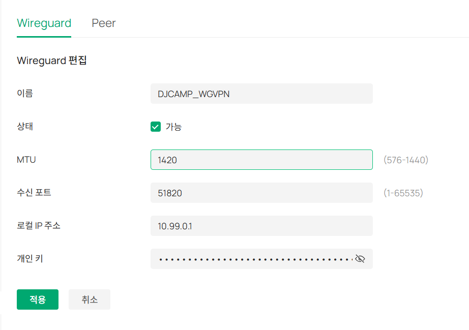
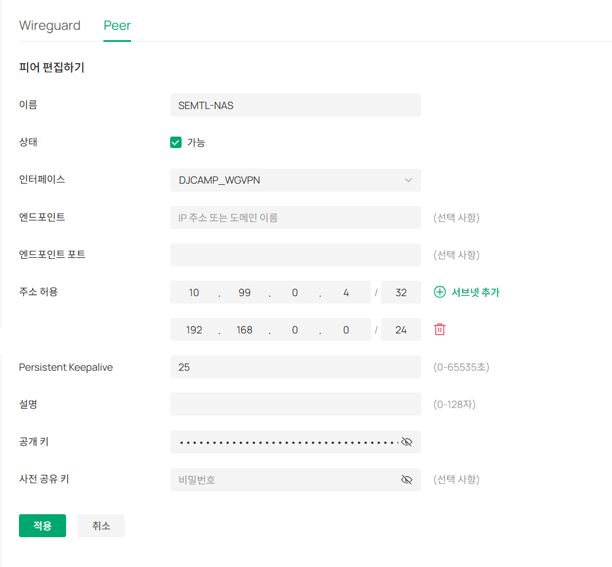
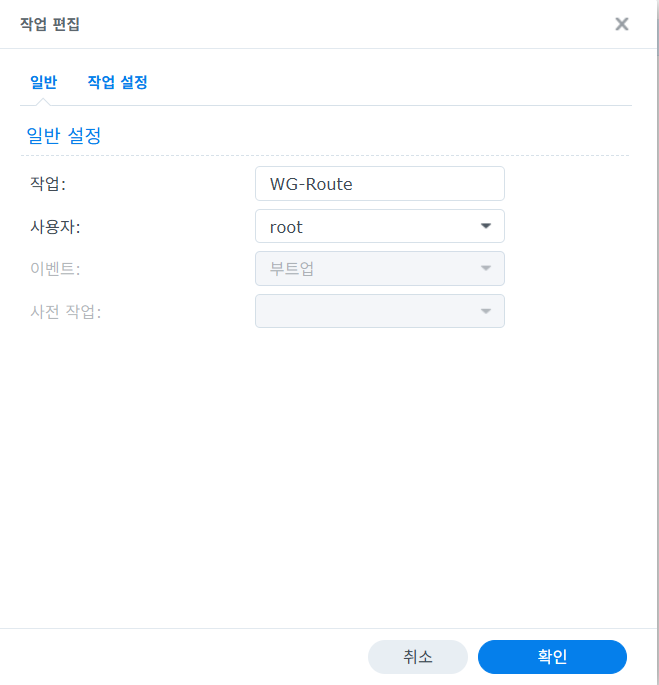
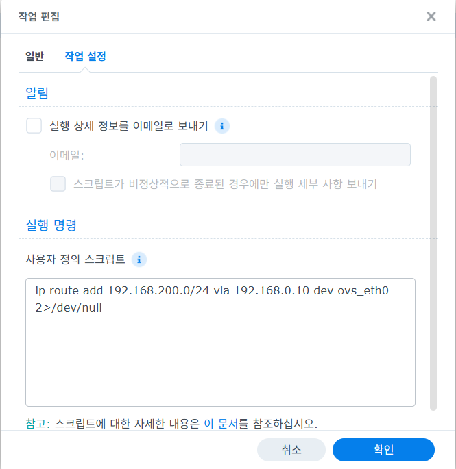
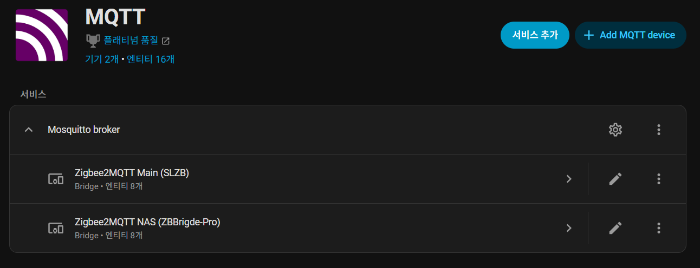

# Synology Alpine VM WireGuard Zigbee2MQTT HA Integration

## 개요

이 문서는 Synology NAS에서 `Alpine Linux` VM을 만들고, 해당 VM에
`WireGuard`를 구성한 뒤, Synology NAS의 스케줄러와 Docker 기반
`zigbee2mqtt`를 이용해 원격 Zigbee Bridge를 `Home Assistant`까지 연동하는
절차를 정리합니다.

이 문서에서 다루는 최종 구조는 아래와 같습니다.

```text
Home Assistant
-> MQTT Broker
-> zigbee2mqtt 컨테이너 (Synology NAS)
-> NAS 라우팅
-> Alpine VM (WireGuard Client)
-> WireGuard Tunnel
-> Omada 측 WireGuard Server / 원격 LAN
-> Zigbee Bridge (tcp://192.168.200.192:8888)
```

## 아키텍처와 예시 값

- Synology NAS IP: `192.168.0.2`
- Alpine WireGuard VM IP: `192.168.0.10`
- MQTT Broker IP: `192.168.0.21`
- Home Assistant IP: `192.168.0.21`
- Omada 공인 진입 주소 예시: `djcamp.ddnsfree.com:51820/udp`
- WireGuard 터널 대역 예시: `10.99.0.0/24`
- Alpine VM 터널 IP 예시: `10.99.0.4/24`
- 원격 Zigbee 대역: `192.168.200.0/24`
- 원격 Zigbee Bridge: `192.168.200.192:8888`
- Zigbee2MQTT UI 포트: `8099/tcp`

운영 원칙:

- `WireGuard`는 NAS 컨테이너가 아니라 별도 Alpine VM에서 종료
- NAS는 원격 Zigbee 대역만 Alpine VM으로 보냄
- `zigbee2mqtt` 컨테이너는 일반 `bridge` 네트워크로 유지
- `Home Assistant`는 MQTT Discovery로 연동

## 사전 조건

- Synology DSM 관리자 권한
- Synology `Virtual Machine Manager` 사용 가능 상태
- Synology `Container Manager` 또는 Docker CLI 사용 가능 상태
- Omada 측 `WireGuard Server` 또는 이에 준하는 원격 WireGuard 서버 정보 확보
- 원격 Zigbee Bridge가 `tcp://192.168.200.192:8888`로 접근 가능한 상태
- MQTT Broker 준비 완료
- `Home Assistant`의 MQTT 통합 추가 가능 상태

필수 준비 정보:

- WireGuard 서버 공개키
- WireGuard 서버 접속 주소 또는 DDNS
- WireGuard 서버 포트
- 클라이언트에 할당할 터널 IP
- 서버 측 허용 라우트(`AllowedIPs`) 정책

## 1. Synology NAS에서 Alpine VM 생성

### 1-1. Alpine ISO 준비

1. `alpinelinux.org`에서 `Alpine Virtual` ISO를 다운로드
1. Synology `Virtual Machine Manager`에 ISO 업로드

권장:

- 초경량 용도면 `Alpine Virtual` ISO 우선
- 장기 운영 시 문서 작성 시점의 최신 안정 버전 사용

### 1-2. Synology VMM에서 VM 생성

`Virtual Machine Manager`에서 Linux VM을 새로 생성합니다.

권장 사양:

- vCPU: `1`
- Memory: `512MB`
- Disk: `10GB` 이상
- Network: NAS와 같은 LAN 연결
- 부팅 ISO: Alpine ISO

예시 운영값:

- VM 이름: `vm-wg`
- 고정 IP: `192.168.0.10`
- Gateway: `192.168.0.1`
- DNS: `192.168.0.2`

### 1-3. Alpine 기본 설치

VM을 부팅한 뒤 콘솔에서 설치를 진행합니다.

```bash
setup-alpine
```

설치 중 권장값:

- keyboard: `us`
- hostname: `vm-wg`
- interface: 실제 NIC 선택(`eth0` 또는 `ens18`)
- IP: `static`
- address: `192.168.0.10/24`
- gateway: `192.168.0.1`
- DNS: `192.168.0.2`
- timezone: `Asia/Seoul`
- disk mode: `sys`

설치 후 재부팅:

```bash
reboot
```

### 1-4. Alpine 설치 직후 확인

```bash
ip -br addr
ip route
cat /etc/resolv.conf
ping -c 3 192.168.0.1
ping -c 3 192.168.0.2
```

정상 기준:

- 관리 IP가 `192.168.0.10/24`
- 기본 게이트웨이가 `192.168.0.1`
- DNS가 `192.168.0.2`

### 1-5. VM 기본 운영값 정리

`## 1`이 끝나면 아래 기준으로 VM 초기 상태를 맞춥니다.

`VM-WG [SEMTL-NAS]` 기준:

- CPU 코어: `1`
- 메모리: `512MB`
- MAC 주소: `02:11:32:29:7D:6D`
- 컴퓨터 이름: `vm-wg`
- 계정: `root`, `semtl`

운영 메모:

- Alpine 설치 직후 `semtl` 계정이 없다면 먼저 생성합니다.

예시:

```bash
adduser semtl
passwd root
passwd semtl
```

### 1-6. `qemu-guest-agent` 설치

Synology VMM에서도 게스트 상태 확인을 쉽게 하려면 `qemu-guest-agent`를 설치합니다.

```bash
apk add qemu-guest-agent
rc-service qemu-guest-agent start
rc-update add qemu-guest-agent
rc-service qemu-guest-agent status
```

확인 기준:

- `qemu-guest-agent` 서비스가 `started`
- Synology VMM에서 게스트 상태 조회가 정상

### 1-7. `/etc/hosts`, `/etc/resolv.conf` 보정

`/etc/hosts` 예시:

```text
127.0.0.1 localhost.localdomain localhost
192.168.0.10 wg.internal.semtl.synology.me vm-wg

::1     ip6-localhost ip6-loopback
fe00::0 ip6-localnet
ff00::0 ip6-mcastprefix
ff02::1 ip6-allnodes
ff02::2 ip6-allrouters
ff02::3 ip6-allhosts
```

`/etc/resolv.conf` 예시:

```text
search internal.semtl.synology.me
nameserver 192.168.0.2
nameserver 1.1.1.1
```

적용 후 확인:

```bash
hostname
hostname -f
cat /etc/hosts
cat /etc/resolv.conf
ping -c 3 192.168.0.2
```

정상 기준:

- `hostname` 결과가 `vm-wg`
- `hostname -f` 결과가 `wg.internal.semtl.synology.me`
- DNS 조회와 기본 통신이 정상

### 1-8. 스냅샷 전 정리

초기 구성과 게스트 에이전트, hostname/DNS 보정까지 끝나면 스냅샷 전에
불필요 파일을 정리합니다.

```bash
cat << 'EOF' > cleanup.sh
#!/bin/sh

echo "[1] APK cache 정리"
apk cache clean
rm -rf /var/cache/apk/*

echo "[2] 로그 정리"
find /var/log -type f -exec truncate -s 0 {} \;

echo "[3] tmp 정리"
/bin/rm -rf /tmp/*
/bin/rm -rf /var/tmp/*

echo "[4] 사용자 히스토리 삭제"
truncate -s 0 /home/semtl/.ash_history 2>/dev/null
truncate -s 0 /home/semtl/.bash_history 2>/dev/null
truncate -s 0 /root/.ash_history 2>/dev/null
truncate -s 0 /root/.bash_history 2>/dev/null

echo "[5] 현재 세션 히스토리 제거"
unset HISTFILE
history -c 2>/dev/null

echo "[6] orphan 소켓 정리 (선택)"
find /tmp -type s -delete 2>/dev/null

echo "[7] sync"
sync

echo "[✔ 완료] 스냅샷 준비 완료"
EOF

chmod +x cleanup.sh

sudo ./cleanup.sh
```

### 1-9. Synology VMM 스냅샷 생성

위 정리가 끝나면 Synology VMM에서 기준 스냅샷을 생성합니다.

권장 시점:

- Alpine 설치 완료 후
- `qemu-guest-agent` 설치 완료 후
- `semtl` 계정 생성 완료 후
- `/etc/hosts`, `/etc/resolv.conf` 보정 완료 후
- WireGuard 설치 전 기준점을 남기고 싶을 때

스냅샷 :

```text
#1. VM-WG [SEMTL-NAS]
- CPU 코어 : 1
- 메모리 : 512MB
- MAC 주소 : 02:11:32:29:7D:6D
- 컴퓨터이름 : vm-wg
- ID : root / semtl
- PW : 127001 / 127001
- QEMU 게스트 에이전트 설치
- /etc/hosts, /etc/resolv.conf 수정
- 스냅샷전 정리
```

## 2. Alpine VM에 WireGuard 설정

### 2-1. 패키지 설치

```bash
apk update
apk add wireguard-tools iptables iproute2
```

커널 모듈 확인:

```bash
modprobe wireguard
```

### 2-2. WireGuard 키 생성

```bash
mkdir -p /etc/wireguard
chmod 700 /etc/wireguard

wg genkey | tee /etc/wireguard/privatekey | wg pubkey > /etc/wireguard/publickey
chmod 600 /etc/wireguard/privatekey
chmod 644 /etc/wireguard/publickey
```

공개키 확인:

```bash
cat /etc/wireguard/publickey
```

### 2-3. `wg0.conf` 작성

`/etc/wireguard/wg0.conf` 예시:

```ini
[Interface]
PrivateKey = <ALPINE_VM_PRIVATE_KEY>
Address = 10.99.0.4/24
MTU = 1420
PostUp = iptables -t nat -A POSTROUTING -o wg0 -j MASQUERADE; iptables -A FORWARD -i eth0 -o wg0 -j ACCEPT; iptables -A FORWARD -i wg0 -o eth0 -j ACCEPT; iptables -A FORWARD -p tcp --tcp-flags SYN,RST SYN -j TCPMSS --clamp-mss-to-pmtu
PostDown = iptables -t nat -D POSTROUTING -o wg0 -j MASQUERADE; iptables -D FORWARD -i eth0 -o wg0 -j ACCEPT; iptables -D FORWARD -i wg0 -o eth0 -j ACCEPT; iptables -D FORWARD -p tcp --tcp-flags SYN,RST SYN -j TCPMSS --clamp-mss-to-pmtu

[Peer]
PublicKey = <OMADA_OR_REMOTE_SERVER_PUBLIC_KEY>
Endpoint = djcamp.ddnsfree.com:51820
AllowedIPs = 10.99.0.0/24, 192.168.200.0/24
PersistentKeepalive = 25
```

운영 메모:

- 실제 `PrivateKey`와 실운영 `PublicKey`는 문서에 커밋하지 않고 로컬 파일에만 보관합니다.
- `AllowedIPs = 0.0.0.0/0`는 이 문서 목적에 맞지 않습니다.
- 이 문서에서는 원격 Zigbee 대역만 터널로 보내는 split tunnel 구성을 전제로 합니다.
- NIC 이름이 `eth0`가 아니라 `ens18` 등으로 보이면 `PostUp`, `PostDown`도 함께 변경합니다.

파일 권한 적용:

```bash
chmod 600 /etc/wireguard/wg0.conf
```

### 2-4. IP Forward 활성화

```bash
nano /etc/sysctl.conf
```

파일 제일 아래에 아래 내용을 추가합니다.

```text
# WireGuard Gateway Settings
# 라우터 기능 활성화 (필수)
net.ipv4.ip_forward=1
# VPN 환경에서 비대칭 라우팅 허용
net.ipv4.conf.all.rp_filter=0
net.ipv4.conf.default.rp_filter=0
```

```bash
sysctl -p
sysctl net.ipv4.ip_forward
sysctl net.ipv4.conf.all.rp_filter
sysctl net.ipv4.conf.default.rp_filter
```

정상 기준:

- `net.ipv4.ip_forward = 1`
- `net.ipv4.conf.all.rp_filter = 0`
- `net.ipv4.conf.default.rp_filter = 0`

### 2-5. WireGuard 기동과 자동 시작

```bash
wg-quick up wg0
wg show
```

구분:

- `/etc/sysctl.conf`는 `ip_forward`, `rp_filter` 같은 커널 네트워크 옵션을 부팅 후에도 유지하는 설정입니다.
- OpenRC 자동 시작은 `wg-quick.wg0` 서비스로 등록합니다.
- 즉, `sysctl.conf`를 수정했다고 해서 `WireGuard`가 자동 기동되지는 않습니다.

OpenRC 자동 시작 등록:

```bash
apk add wireguard-tools-openrc
ln -s /etc/init.d/wg-quick /etc/init.d/wg-quick.wg0
rc-service wg-quick.wg0 start
rc-update add wg-quick.wg0 default
```

필요 시 부팅 후 상태 확인:

```bash
rc-service wg-quick.wg0 status
sudo wg show
ip route
```

## 3. Omada에서 WireGuard 서버 설정

이 단계는 Omada Gateway에서 WireGuard 서버를 직접 운영하는 경우에 적용합니다.

### 3-1. Omada WireGuard Server 생성

Omada `Wireguard 편집` 화면 기준으로 서버 인터페이스는 아래처럼 설정합니다.



캡션: Omada WireGuard 서버 인터페이스 `DJCAMP_WGVPN`, `MTU 1420`, 수신 포트 `51820`, 로컬 IP `10.99.0.1`

- 이름: `DJCAMP_WGVPN`
- 상태: `가능`
- MTU: `1420`
- 수신 포트: `51820`
- 로컬 IP 주소: `10.99.0.1`
- 개인 키: Omada가 생성한 WireGuard 서버 개인 키 사용

운영 메모:

- 이 화면의 `로컬 IP 주소 10.99.0.1`은 WireGuard 서버 인터페이스 주소입니다.
- Alpine VM은 같은 터널 대역의 `10.99.0.4/24`를 사용합니다.
- 이후 `Peer` 탭에서 `SEMTL-NAS` 피어를 추가하고 Alpine VM 공개키를 등록합니다.

### 3-2. Omada Peer 편집 화면 기준 설정

Omada `Peer` 화면 기준으로 `SEMTL-NAS` 피어는 아래처럼 입력합니다.



캡션: `SEMTL-NAS` 피어 예시, 인터페이스 `DJCAMP_WGVPN`, 주소 허용 `10.99.0.4/32`, `192.168.0.0/24`

- 이름: `SEMTL-NAS`
- 상태: `가능`
- 인터페이스: `DJCAMP_WGVPN`
- 엔드포인트: 비워둠
- 엔드포인트 포트: 비워둠
- 주소 허용 1: `10.99.0.4/32`
- 주소 허용 2: `192.168.0.0/24`
- Persistent Keepalive: `25`
- 설명: 선택 사항
- 공개 키: Alpine VM의 `publickey`
- 사전 공유 키: 비워둠

운영 메모:

- `주소 허용`에 `10.99.0.4/32`와 `192.168.0.0/24`를 함께 넣어야 NAS 대역이
  Alpine VM 뒤 클라이언트로 인식됩니다.
- 엔드포인트와 엔드포인트 포트는 일반적인 클라이언트 피어 구성에서는 비워둬도 됩니다.
- 공개 키는 Alpine VM에서 `cat /etc/wireguard/publickey` 결과를 사용합니다.

### 3-3. Omada 측 Peer 허용 대역 확인

Omada 또는 원격 WireGuard 서버에는 아래 항목이 반영되어야 합니다.

- Alpine VM 터널 IP: `10.99.0.4/32`
- NAS가 있는 로컬 LAN: `192.168.0.0/24`

상황에 따라 서버 측에서 아래 둘 중 하나가 필요합니다.

- 라우팅 방식: `192.168.0.0/24` 대역을 Alpine VM 뒤 클라이언트로 인지
- NAT 방식: Alpine VM에서 MASQUERADE된 트래픽만 허용

### 3-4. Omada 방화벽/정책 확인

- `51820/udp` 인바운드 허용
- 원격 Zigbee Bridge 포트 `8888/tcp` 접근 허용
- WireGuard 인터페이스에서 원격 LAN으로의 포워딩 허용

검증 기준:

- Alpine VM에서 `wg show` 시 handshake 갱신
- Alpine VM에서 `ping 192.168.200.192` 또는 `nc -vz 192.168.200.192 8888` 성공

## 4. Synology NAS에 라우팅 설정

### 4-1. DSM 작업 스케줄러로 라우트 적용

실제 운영에서는 DSM `Static Route`가 기대대로 동작하지 않아 `작업 스케줄러`로
라우트를 적용했습니다.

경로:

1. DSM `Control Panel`
1. `Task Scheduler`
1. `생성`
1. `트리거된 작업`
1. `사용자 정의 스크립트`

일반 설정 화면 예시:



캡션: 작업명 `WG-Route`, 사용자 `root`, 이벤트 `부트업`

권장값:

- 작업: `WG-Route`
- 사용자: `root`
- 이벤트: `부트업`

작업 설정 화면 예시:



캡션: 사용자 정의 스크립트에 원격 Zigbee 대역 라우트 추가

스크립트 예시:

```bash
ip route add 192.168.200.0/24 via 192.168.0.10 dev ovs_eth0 2>/dev/null
```

운영 메모:

- 이 문서 기준 권장 방식은 `작업 스케줄러`입니다.
- 재부팅 후에도 `192.168.200.0/24` 경로를 일관되게 복구할 수 있습니다.
- Synology 네트워크 인터페이스명이 `ovs_eth0`가 아닐 수 있으므로 환경에 맞게 조정합니다.

### 4-2. Synology NAS에서 경로 확인

```bash
ip route
ping 192.168.200.192
```

정상 기준:

- `192.168.200.0/24 via 192.168.0.10` 경로 확인
- NAS에서 원격 Zigbee Bridge에 도달 가능

## 5. Synology NAS에 Zigbee2MQTT 설치

### 5-1. 작업 디렉터리 생성

```bash
mkdir -p /volume1/docker/zigbee2mqtt-zbbridge-pro/data
```

권장 파일 구조:

```text
/volume1/docker/zigbee2mqtt-zbbridge-pro/
├── docker-compose.yml
└── data/
    └── configuration.yaml
```

### 5-2. `docker-compose.yml` 작성

```yaml
services:
  zigbee2mqtt-zbbridge-pro:
    image: ghcr.io/koenkk/zigbee2mqtt:latest
    container_name: zigbee2mqtt-zbbridge-pro
    restart: unless-stopped
    environment:
      - TZ=Asia/Seoul
      - Z2M_WATCHDOG=default
    volumes:
      - /volume1/docker/zigbee2mqtt-zbbridge-pro/data:/app/data
    ports:
      - "8099:8099"
    networks:
      - zigbee2mqtt

networks:
  zigbee2mqtt:
    name: zigbee2mqtt
    driver: bridge
```

주의:

- NAS 라우팅만으로 원격 Zigbee 대역을 Alpine VM으로 보낼 수 있어야 합니다.

### 5-3. `configuration.yaml` 작성

```yaml
version: 5

homeassistant:
  enabled: true

mqtt:
  server: mqtt://192.168.0.21:1883
  user: zigbee2mqtt
  password: mypassword123
  base_topic: zigbee2mqtt_zbbridge_pro

serial:
  port: tcp://192.168.200.192:8888
  baudrate: 115200
  adapter: zstack

frontend:
  enabled: true
  port: 8099

advanced:
  log_level: info
  channel: 15
  pan_id: 4660
  ext_pan_id:
    - 1
    - 2
    - 3
    - 4
    - 5
    - 6
    - 7
    - 8
  network_key:
    - 1
    - 3
    - 5
    - 7
    - 9
    - 11
    - 13
    - 15
    - 2
    - 4
    - 6
    - 8
    - 10
    - 12
    - 14
    - 16

availability:
  enabled: true

device_options: {}
groups: {}
devices: {}
```

운영 메모:

- `mqtt.user`, `mqtt.password`는 실제 값으로 교체합니다.
- `base_topic`은 기존 Zigbee2MQTT 인스턴스와 겹치지 않게 분리합니다.
- 원격 브리지 종류에 따라 `adapter` 값은 조정이 필요할 수 있습니다.
- 원격 TCP 브리지 환경에서는 `Z2M_WATCHDOG=default`를 두는 편이 재시작 복구에 유리합니다.

### 5-4. 컨테이너 기동

```bash
cd /volume1/docker/zigbee2mqtt-zbbridge-pro
docker compose up -d
docker compose ps
```

로그 확인:

```bash
docker logs -f zigbee2mqtt-zbbridge-pro
```

정상 로그 예시:

- `MQTT connected`
- `serial port opened`
- `Zigbee started`

## 6. Home Assistant 연동

이 구성에서는 `zigbee2mqtt`의 MQTT Discovery를 사용해 `Home Assistant`에 장치가
자동 등록되도록 합니다.

사전 확인:

- `Home Assistant`에 MQTT 통합이 이미 추가되어 있음
- MQTT 브로커 주소가 `zigbee2mqtt` 설정과 동일함
- `base_topic`이 기존 인스턴스와 충돌하지 않음

확인 순서:

1. `Home Assistant > Settings > Devices & Services > MQTT` 상태 확인
1. `zigbee2mqtt` 로그에서 MQTT 연결 성공 확인
1. `Home Assistant`의 `Devices` 또는 `Entities` 목록에서 새 Zigbee 장치 확인

연동 확인 화면 예시:



캡션: Home Assistant `MQTT` 통합에 `Zigbee2MQTT NAS (ZBBridge-Pro)`가 등록된 상태

검증 기준:

- Zigbee2MQTT UI: `http://<NAS_IP>:8099`
- Home Assistant에 Zigbee 장치와 엔터티 생성 확인

## 7. 검증 순서

### 7-1. Alpine VM 검증

```bash
ip a
sudo wg show
ping 192.168.200.192
nc -vz 192.168.200.192 8888
```

### 7-2. Synology NAS 검증

```bash
ip route
sudo ping 192.168.200.192
```

### 7-3. Zigbee2MQTT 검증

```bash
docker logs --tail 100 zigbee2mqtt-zbbridge-pro
```

### 7-4. Home Assistant 검증

- MQTT 통합 정상
- Zigbee 장치 자동 발견
- 엔터티 상태 수집 확인

## 트러블슈팅

### 1. Alpine VM은 연결되는데 NAS에서 원격 Zigbee 대역 접근이 안 됨

점검:

- DSM 작업 스케줄러의 부팅 스크립트가 정상 실행됐는지 확인
- `ip route`에 `192.168.200.0/24 via 192.168.0.10`가 보이는지 확인
- Alpine VM의 `net.ipv4.ip_forward=1` 적용 여부 확인

### 2. `wg show`에 handshake가 안 생김

점검:

- `Endpoint`, 서버 공개키, 로컬 비공개키 재확인
- Omada 또는 원격 장비에서 `51820/udp` 허용 여부 확인
- DDNS/FQDN이 올바른 공인 IP를 가리키는지 확인

### 3. Alpine VM에서 `192.168.200.192:8888`가 안 열림

점검:

- Omada 측 ACL/방화벽
- 원격 Zigbee Bridge 서비스 상태
- `AllowedIPs`에 `192.168.200.0/24` 포함 여부

### 4. Zigbee2MQTT UI는 뜨는데 장치가 안 올라옴

점검:

- `serial.port: tcp://192.168.200.192:8888`
- `adapter` 타입
- Zigbee Bridge 펌웨어/모드

### 5. MQTT는 연결됐는데 Home Assistant에 장치가 안 보임

점검:

- `homeassistant.enabled: true`
- MQTT 통합과 자동 발견 상태
- `base_topic` 충돌 여부

## 참고

- [Synology Installation](./installation.md)
- [WireGuard VM 설정 공유 링크](https://chatgpt.com/share/69c124dc-47a8-8009-929f-f5b5cf025ef9)
