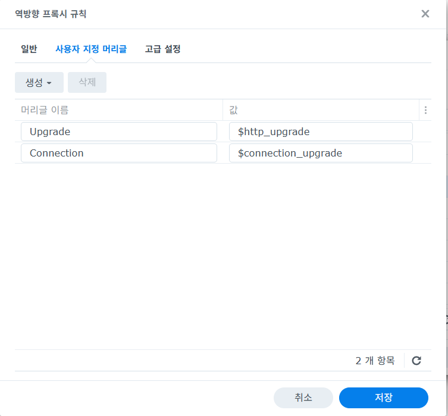
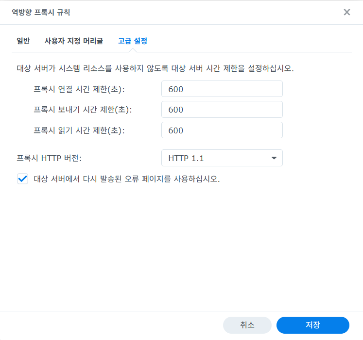

# ttyd Installation

## 개요

이 문서는 `Ubuntu`와 `Alpine Linux` VM에서 `ttyd`를 설치해 웹 브라우저로
터미널에 접속하는 절차를 정리합니다.

대상 OS:

- `Ubuntu 22.04 LTS` 이상
- `Alpine Linux 3.x`

이 문서에서는 설치 자체에 집중하고, 외부 노출은 내부망 또는 리버스 프록시 뒤에서
운영하는 것을 전제로 합니다.

## ttyd 선택 기준

`ttyd`는 단일 바이너리 기반의 경량 웹 터미널입니다.

운영 메모:

- 브라우저에서 SSH 대신 직접 셸을 노출할 수 있습니다.
- 기본 인증(`-c`)과 TLS 옵션을 지원합니다.
- 내부망에서 먼저 검증하고, 외부 공개 시에는 NAS 또는 프록시에서 인증과 TLS를
  함께 거는 구성을 권장합니다.

## 사전 조건

- VM 생성 및 기본 네트워크 연결 완료
- 관리자 권한 계정 또는 `root` 접속 가능
- 서비스로 띄울 셸 또는 명령 결정
  - 예: `bash`
  - 예: `sh`
  - 예: `ssh user@localhost`

기본 포트 예시:

- `7681/tcp`

## 1. Ubuntu 설치

Ubuntu에서는 먼저 APT 패키지 설치를 시도합니다.

```bash
sudo apt update
sudo apt install -y ttyd
```

설치 확인:

```bash
ttyd -v
command -v ttyd
```

패키지가 보이지 않으면 아래 항목을 먼저 확인합니다.

- `universe` 저장소 활성화 여부
- 사용 중인 Ubuntu 릴리스에서 `ttyd` 패키지 제공 여부

`apt install ttyd`가 불가능한 환경이면 아래의
`공식 바이너리 설치` 절차를 사용합니다.

## 2. Alpine Linux 설치

Alpine은 이 문서 기준으로 패키지 설치 대신 아래
`공식 바이너리 설치` 절차를 사용합니다.

운영 메모:

- Alpine에서는 `/usr/local/bin/ttyd` 경로를 기준으로 이후 예시를 맞춥니다.

## 3. 공식 바이너리 설치

패키지 설치가 어려우면 `ttyd` 공식 릴리스 바이너리를 사용합니다.
이 방식은 Ubuntu와 Alpine 모두에서 공통으로 사용할 수 있습니다.

### x86_64 예시

아래 버전은 `2026-03-25` 기준 최신 공식 릴리스(`1.7.7`)를 사용한
예시입니다.

```bash
VERSION="1.7.7"
sudo curl -L \
  "https://github.com/tsl0922/ttyd/releases/download/${VERSION}/ttyd.x86_64" \
  -o /usr/local/bin/ttyd
sudo chmod +x /usr/local/bin/ttyd
ttyd -v
```

주의:

- CPU 아키텍처에 맞는 바이너리를 내려받아야 합니다.
- 최신 버전과 다른 아키텍처 파일명은 공식 릴리스 페이지에서 확인합니다.

## 4. 즉시 실행

가장 단순한 검증은 아래와 같이 바로 띄워보는 방식입니다.

Ubuntu 예시:

```bash
ttyd -p 7681 -c admin:change-me bash
```

Alpine 예시:

```sh
ttyd -p 7681 -c admin:change-me sh
```

SSH 세션을 브라우저로 중계하고 싶으면 다음과 같이 사용할 수 있습니다.

```bash
ttyd -p 7681 -c admin:change-me ssh user@localhost
```

연결을 더 오래 유지하고 싶으면 다음처럼 `ttyd` websocket ping과 SSH keepalive를
함께 설정합니다.

```bash
ttyd -P 30 -p 7681 -c admin:change-me \
  ssh \
  -o StrictHostKeyChecking=no \
  -o ServerAliveInterval=60 \
  -o ServerAliveCountMax=10 \
  semtl@localhost
```

`ttyd` 안에서 `tmux`를 함께 쓰고 싶지만 굳이 커스텀 소켓까지 나누고 싶지 않다면,
기본 소켓에서 세션 이름만 분리해도 됩니다.

예:

```bash
ttyd -P 30 -p 7681 -c admin:change-me \
  ssh \
  -o StrictHostKeyChecking=no \
  -o ServerAliveInterval=60 \
  -o ServerAliveCountMax=10 \
  semtl@localhost \
  'tmux new -A -s webmain'
```

접속 URL:

- `http://<vm-ip>:7681`

주의:

- `admin:change-me`는 예시이므로 실제 운영 비밀번호로 바꿉니다.
- 외부 공개 전에는 방화벽, 접근 제어, 프록시 인증 정책을 함께 검토합니다.

## 5. Ubuntu systemd 서비스 등록

Ubuntu에서 상시 운영하려면 `systemd` 서비스 등록을 권장합니다.

서비스 파일:

```ini
[Unit]
Description=ttyd web terminal
After=network.target ssh.service

[Service]
Type=simple
User=semtl
ExecStart=/usr/bin/ttyd \
  -W \
  -P 30 \
  -p 7681 \
  -c admin:change-me \
  -t fontSize=16 \
  -t fontFamily=Consolas,Monaco,monospace \
  -t lineHeight=1.2 \
  -t letterSpacing=0.3 \
  ssh \
  -o StrictHostKeyChecking=no \
  -o ServerAliveInterval=60 \
  -o ServerAliveCountMax=10 \
  semtl@localhost
Restart=always
RestartSec=3

[Install]
WantedBy=multi-user.target
```

패키지 설치 기준으로 아래 경로에 저장합니다.

```bash
sudo vi /etc/systemd/system/ttyd.service
```

적용:

```bash
sudo systemctl daemon-reload
sudo systemctl enable --now ttyd
sudo systemctl status ttyd
```

`admin:change-me` 부분만 실제 운영 비밀번호로 바꿉니다.
공식 바이너리를 `/usr/local/bin/ttyd`에 설치했다면 `ExecStart` 경로만 맞게
수정합니다.

## 6. Alpine OpenRC 자동 시작

Alpine에서는 `/etc/init.d/ttyd` 파일을 직접 만들어 `openrc` 서비스로
등록합니다.

`/etc/init.d/ttyd` 예시:

```sh
#!/sbin/openrc-run

name="ttyd"
description="ttyd web terminal service"

command="/usr/local/bin/ttyd"
command_args="-W -P 30 -p 7681 -c admin:change-me \
  -t 'fontSize=16' \
  -t 'fontFamily=Consolas,Monaco,monospace' \
  -t 'lineHeight=1.2' \
  -t 'letterSpacing=0.3' \
  ssh -o StrictHostKeyChecking=no \
  -o ServerAliveInterval=60 \
  -o ServerAliveCountMax=10 \
  semtl@localhost"
command_background="yes"
pidfile="/run/${RC_SVCNAME}.pid"

depend() {
    need net
    after firewall
}
```

파일 생성:

```sh
vi /etc/init.d/ttyd
chmod +x /etc/init.d/ttyd
```

적용:

```sh
rc-update add ttyd default
rc-service ttyd start
rc-service ttyd status
```

Alpine은 이 문서 기준으로 `command="/usr/local/bin/ttyd"`를 사용합니다.
`admin:change-me` 부분만 실제 운영 비밀번호로 바꿉니다.

## 7. 검증

VM 내부 확인:

```bash
ss -lntp | grep 7681
```

웹 확인:

- 브라우저에서 `http://<vm-ip>:7681` 접속
- 인증 창이 나오고 셸이 표시되는지 확인

서비스 확인:

- Ubuntu: `systemctl status ttyd`
- Alpine: `rc-service ttyd status`

## 8. 트러블슈팅

### 일정 시간 후 내부 SSH 인증 비밀번호를 다시 물어봄

이 문서에서 말하는 증상은 `ttyd` 자체 접속 비밀번호가 아니라,
`ttyd` 안에서 실행 중인 `ssh semtl@localhost`가 다시 Linux 사용자 비밀번호를
묻는 경우를 의미합니다.

현재 문서 예시처럼 아래 방식으로 실행하면:

```bash
ttyd -p 7681 -c admin:change-me ssh -o StrictHostKeyChecking=no semtl@localhost
```

운영 메모:

- 내부 SSH 세션이 끊기면 Linux 사용자 비밀번호를 다시 물을 수 있습니다.
- 즉, 이 증상은 보통 `ttyd` Basic Auth가 아니라 내부 SSH 재인증입니다.

#### 권장 실행 옵션

연결 유지 시간을 늘리려면 아래 옵션 조합을 권장합니다.

```bash
ttyd -P 30 -p 7681 -c admin:change-me \
  ssh \
  -o StrictHostKeyChecking=no \
  -o ServerAliveInterval=60 \
  -o ServerAliveCountMax=10 \
  semtl@localhost
```

뜻:

- `-P 30`: `ttyd`가 30초마다 websocket ping 전송
- `ServerAliveInterval=60`: SSH가 60초마다 keepalive 전송
- `ServerAliveCountMax=10`: 일시적인 응답 끊김을 더 오래 허용

#### 확인 방법

쉘 idle timeout 확인:

```bash
echo $TMOUT
```

SSH 서버 설정 확인:

```bash
grep -nE 'ClientAlive|LoginGraceTime|PasswordAuthentication' /etc/ssh/sshd_config
```

해석 포인트:

- `echo $TMOUT`가 비어 있으면 bash idle timeout이 없는 상태입니다.
- `ClientAliveInterval 0`이면 SSH 서버가 idle client를 주기적으로 끊도록 설정된
  상태가 아닙니다.
- 따라서 이 문서 기준 증상은 `sshd_config` 타임아웃보다 `ttyd -> ssh localhost`
  재접속 구조 때문일 가능성이 더 큽니다.

#### `Last login ... from 127.0.0.1`가 보이는 이유

`ttyd`가 아래처럼 실행 중이면:

```bash
ttyd -p 7681 -c admin:change-me ssh -o StrictHostKeyChecking=no semtl@localhost
```

브라우저에서 보는 셸은 실제로 `localhost`로 다시 SSH 접속한 세션입니다.

그래서 로그인 기록은 다음처럼 보일 수 있습니다.

```text
Last login: ... from 127.0.0.1
```

이 의미는:

- 외부 PC가 직접 SSH로 붙은 것이 아니라
- 서버 내부에서 `ssh semtl@localhost`가 새로 시작되었다는 뜻입니다.

즉 비밀번호를 다시 묻는 시점은, 기존 내부 SSH 세션이 끊기고 새 localhost SSH
세션이 다시 만들어지는 상황으로 볼 수 있습니다.

#### 권장 해결

- 가능하면 `ssh` 비밀번호 대신 SSH key 로그인으로 전환
- 장시간 작업은 `tmux`로 유지
- Reverse Proxy 또는 브라우저 쪽 재인증 정책도 함께 확인

#### Synology Reverse Proxy 사용 시 권장값

직접 `http://<vm-ip>:7681`로 접근하면 문제가 없고, Synology Reverse Proxy를
거칠 때만 재로그인이 발생하면 프록시 쪽 websocket 처리도 함께 점검합니다.

사용자 지정 헤더:

- `Upgrade: $http_upgrade`
- `Connection: $connection_upgrade`

예시 화면:



고급 설정 권장값:

- `프록시 연결 시간 제한(초)`: `600`
- `프록시 보내기 시간 제한(초)`: `600`
- `프록시 읽기 시간 제한(초)`: `600`
- `프록시 HTTP 버전`: `HTTP 1.1`

예시 화면:



운영 메모:

- 위 값은 Synology Reverse Proxy에서 websocket idle timeout 영향을 줄이는 데
  도움이 됩니다.
- 그래도 재연결이 발생하면 브라우저 탭 절전 또는 내부 SSH 재접속 구조를 함께
  의심해야 합니다.

#### `tmux`를 같이 쓸 때 소켓 선택

`ttyd`에서 `tmux`를 같이 쓸 때는 기본 소켓(`default`) 방식과 커스텀 소켓(`web`)
방식 중 하나를 선택할 수 있습니다.

기본 소켓 방식 예시:

```bash
ttyd -P 30 -p 7681 -c admin:change-me \
  ssh \
  -o StrictHostKeyChecking=no \
  -o ServerAliveInterval=60 \
  -o ServerAliveCountMax=10 \
  semtl@localhost \
  'tmux new -A -s webmain'
```

뜻:

- `tmux new -A -s webmain`: 기본 소켓 `default`에서 `webmain` 세션이 없으면 새로
  만들고, 있으면 그 세션에 다시 붙습니다.

커스텀 소켓 방식 예시:

```bash
ttyd -P 30 -p 7681 -c admin:change-me \
  ssh \
  -o StrictHostKeyChecking=no \
  -o ServerAliveInterval=60 \
  -o ServerAliveCountMax=10 \
  semtl@localhost \
  'tmux -L web new -A -s main'
```

뜻:

- `tmux -L web new -A -s main`: `web`라는 이름의 tmux 소켓에서 `main`
  세션이 없으면 새로 만들고, 있으면 그 세션에 다시 붙습니다.

운영 메모:

- 문제가 없다면 `default` 소켓이 더 단순하고 확인도 쉽습니다.
- `tmux ls`, `tmux attach -t webmain`, `tmux kill-server` 같은 기본 명령을 그대로
  쓸 수 있습니다.
- 커스텀 소켓은 `SSH`와 `ttyd` 환경이 섞여서 제어문자 문제가 날 때만 추가로
  고려하면 됩니다.

#### SSH key 기반으로 전환

`ttyd`가 내부 `ssh semtl@localhost`를 비밀번호 없이 실행할 수 있도록 같은 계정에
SSH key를 등록하면 재로그인 부담을 줄일 수 있습니다.

키 생성:

```bash
ssh-keygen -t ed25519 -f ~/.ssh/id_ed25519 -N ""
```

자기 자신에게 공개키 등록:

```bash
cat ~/.ssh/id_ed25519.pub >> ~/.ssh/authorized_keys
chmod 700 ~/.ssh
chmod 600 ~/.ssh/authorized_keys
```

동작 확인:

```bash
ssh -o StrictHostKeyChecking=no semtl@localhost
```

기대 결과:

- 비밀번호 없이 localhost SSH 접속 성공

이후 `ttyd`는 같은 명령을 유지해도 내부 SSH 비밀번호 재입력 부담이 크게 줄어듭니다.

#### 운영 팁

`ttyd` 안에서 장시간 작업을 직접 유지하기보다,
내부에서는 `tmux` 세션을 사용하고 `ttyd`는 그 세션에 접근하는 용도로 쓰는 편이
안정적입니다.

## 9. 운영 권장사항

- `ttyd`를 인터넷에 직접 노출하지 않고 리버스 프록시 뒤에 둡니다.
- 프록시에서 HTTPS 인증서를 종료하고, `ttyd`는 내부 HTTP로만 운용하는 구성을
  권장합니다.
- 공용 계정보다 운영자별 SSH 계정과 프록시 인증을 조합하는 방식이 더 안전합니다.
- 장기 운영 시에는 VM 방화벽 또는 상위 방화벽에서 `7681/tcp` 접근 대상을 제한합니다.
